# MuleSoft MCD - Level 1 Exam Questions

---

### Question 1

How would you debug Mule applications?

- A. Using breakpoints
- B. Checking RAML
- C. By Deploying apps on production
- D. Cannot do it
- **Correct Answer:**
    
    > A
    >

**Explained**

---

### Question 2

What does to the attributes of a Mule event happen in a flow after an outbound HTTP Request is made?

- A. Attributes do not change.
- B. Previous attributes are passed unchanged.
- C. Attributes are replaced with new attributes from the HTTP Request response.
- D. New attributes may be added from the HTTP response headers, but no headers are ever removed.
- **Correct Answer:**
    
    > C
    >

**Explained**

---

### Question 3

The new RAML spec has been published to Anypoint Exchange with client credentials.

What is the next step to gain access to the API?

- A. Email the owners of the API.
- B. Create a new client application.
- C. No additional steps needed.
- D. Request access to the API in Anypoint Exchange.
- **Correct Answer:**
    
    > D
    >

**Explained**

---

### Question 4

What is the difference between a subflow and a sync flow?

- A. Sync flow has no error handling of its own and subflow does.
- B. Subflow has no error handling of its own and sync flow does.
- C. Subflow is synchronous and sync flow is asynchronous.
- D. No difference.
- **Correct Answer:**
    
    > B
    >

**Explained**

---

### Question 5

What is not an asset?

- A. Exchange
- B. Template
- C. Example
- D. Connector
- **Correct Answer:**
    
    > A
    >

**Explained**

---

### Question 6

How to import Core (dw::Core) module into your DataWeave scripts?

- A. import dw::core
- B. Not needed
- C. None of these
- D. import core
- **Correct Answer:**
    
    > B
    >

**Explained**

---

### Question 7

What is the value of the stepVar variable after the processing of records in a Batch Job?

- A. -1
- B. 0
- C. Null
- D. Last value from flow
- **Correct Answer:**
    
    > C
    > 

## Answer: **D. Array of Mule Event Objects**

### Key Concept: File List Operation

The **File List** operation (from File, FTP, or SFTP connector) scans a directory and returns an **Array of Mule Messages**, where each item represents one file.

Each element in the array is a **Mule event object** containing:

- **Payload** → the file content
- **Attributes** → metadata like filename, size, path, timestamps

### Why this matters?

You can iterate over the result with a **For Each** scope, and inside each iteration, `payload` = file content and `attributes` = file metadata.

### Why not the others?

| Option | Why wrong |
| --- | --- |
| A & B. Strings | Too simplistic — you'd lose all file metadata |
| C. Object (single) | It's a **list** of files, so it must be an Array |

**Explained**

---

### Question 8

What is the object type returned by the File List operation?

- A. Object of String file names
- B. Array of String file names
- C. Object of Mule event objects
- D. Array of Mule event objects
- **Correct Answer:**
    
    > D
    >

**Explained**

---

### Question 9

Where are values of query parameters stored in the Mule event by the HTTP Listener?

- A. Payload
- B. Attributes
- C. Inbound Properties
- D. Variables
- **Correct Answer:**
    
    > B
    >

**Explained**

---

### Question 10

How can you call a flow from Dataweave?

- A. Not allowed
- B. Include function
- C. Look up function
- D. Tag function
- **Correct Answer:**
    
    > C
    >

**Explained**

---

### Question 11

DataWeave is tightly integrated with ____________.

- A. Mule runtime
- B. All APIs
- C. Flow Designer
- D. Exchange
- **Correct Answer:**
    
    > A
    >

**Explained**

---

### Question 12

In the Database On Table Row operation, what does the Watermark column enable the On Table Row operation to do?

- A. To save the most recent records retrieved from a database to enable database caching.
- B. To enable duplicate processing of records in a database.
- C. To avoid duplicate processing of records in a database.
- D. To delete the most recent records retrieved from a database to enable database caching.
- **Correct Answer:**
    
    > C
    >

**Explained**

---

### Question 13

An API has been created in Design Center.   
What is the next step to make the API discoverable?

- A. Deploy the API to a Maven repository.
- B. Publish the API from inside flow designer.
- C. Publish the API to Anypoint Exchange.
- D. Enable autodiscovery in API Manager.
- **Correct Answer:**
    
    > C
    >

**Explained**

---

### Question 14

What is the correct way to format the decimal 200.1234 as a string to two decimal places?

- A. 200.1234 as string {format: “.0#”}
- B. 200.1234 as string as format: “.0#”
- C. 200.1234 as String {format: “.0#”}
- D. 200.1234 as String as format: “.0#”
- **Correct Answer:**
    
    > C
    >

**Explained**

---

### Question 15

How is policy defined in terms of classloader of an API?

- A. Classloader isolation does not exist between the application, the runtime and connectors, and policies.
- B. Classloader isolation exists between the application, the runtime and connectors, and policies.
- C. None of these.
- D. Classloader isolation partially exists between the application, the runtime and connectors, and policies.
- **Correct Answer:**
    
    > B
    > 
    
    ## Answer: **B. Classloader isolation exists between the application, the runtime and connectors, and policies.**
    
    ---
    
    ### What is a ClassLoader?
    
    A **ClassLoader** is a Java mechanism that **loads classes (code) into memory**. Since Mule runs on Java, everything (your app, connectors, policies) is made of Java classes.
    
    > Think of it like separate **sandboxes** — each component loads its own libraries without interfering with others.
    
    
    ---
    
    ### Why does this matter for Policies?
    
    Policies (like rate limiting, auth) are applied to APIs and run as **separate units**. Thanks to isolation:
    
    - A policy's libraries **won't clash** with your app's libraries
    - Different versions of the same library can coexist
    - More **stability and security**
    
    ---
    
    ### Why not the others?
    
    | Option | Why wrong |
    | --- | --- |
    | A. No isolation | Isolation **does** exist |
    | C. None of these | B is correct |
    | D. Partially | Isolation is **full**, not partial |

**Explained**

---

### Question 16

According to Mulesoft, how are Modern APIs treated as?

- A. products
- B. code
- C. soap services
- D. organizations
- **Correct Answer:**
    
    > A
    >

**Explained**

---

### Question 17

According to Semantic Versioning, which version would you change for incompatible API changes?

- A. MINOR
- B. PATCH
- C. MAJOR
- D. No change
- **Correct Answer:**
    
    > C
    >

**Explained**

---

### Question 18

What is the use of DevKit in Mule 4?

- A. Facilitates communication between third-party systems and Mule applications.
- B. No use.
- C. Offers connector end user support in a few aspects of Mule app design.
- D. Enables the development of Anypoint Connectors.
- **Correct Answer:**
    
    > D
    >

**Explained**

---

### Question 19

A Scatter-Gather processes a number of separate HTTP requests. Each request returns a Mule event with a JSON payload.

What is the final output of the Scatter-Gather?

- A. An Object containing all Mule event Objects.
- B. An Array containing all Mule event Objects.
- C. None of these.
- D. The last Mule event object.
- **Correct Answer:**
    
    > A
    >

**Explained**

---

### Question 20

What are the latest specification of RAML available?

- A. 0.8
- B. 1
- C. 2
- D. 1.8
- **Correct Answer:**
    
    > B
    >

**Explained**

---

### Question 21

http://dev.acme.com/api/patients?year=2016

What should this endpoint return?

- A. Patient with id 2016
- B. All patients
- C. No patients
- D. Patients from year 2016
- **Correct Answer:**
    
    > D
    >

**Explained**

---

### Question 22

According to MuleSoft, what is the Center for Enablement’s role in the new IT operating model?

- A. Implements line of business projects to enforce common security requirements.
- B. Centrally manages partners and consultants to implement line of business projects.
- C. Implements line of business projects to enforce common security requirements.
- D. Creates and manages discoverable assets to be consumed by line of business developers.
- **Correct Answer:**
    
    > D
    >

**Explained**

---

### Question 23

Which one of them is NOT a flow in Mule?

- A. sync flow
- B. subflow
- C. async flow
- D. async sub flow
- **Correct Answer:**
    
    > D
    >

**Explained**

---

### Question 24

How are multiple conditions used in a Choice router to route events?

- A. To route the same event to the matched route of EVERY true condition.
- B. None of these.
- C. To find the FIRST true condition, then distribute the event to the ONE matched route.
- D. To find the FIRST true condition, then route the same event to the matched route and ALL FOLLOWING routes.
- **Correct Answer:**
    
    > C
    >

**Explained**

---

### Question 25

What asset can NOT be created by using Design Center?

- A. API
- B. API Portals
- C. Mule Apps
- D. API Fragments
- **Correct Answer:**
    
    > B
    >

**Explained**

---

### Question 26

A flow has a JMS Publish consume operation followed by a JMS Publish
operation. Both of these operations have the default configurations.

Which operation is asynchronous and which one is synchronous?

- A. Publish consume: Synchronous. Publish: Asynchronous.
- B. Publish consume: Asynchronous. Publish: Synchronous.
- C. Publish consume: Asynchronous. Publish: Asynchronous.
- D. Publish consume: Synchronous. Publish: Synchronous.
- **Correct Answer:**
    
    > A
    >

**Explained**

---

### Question 27

What is the use of API Notebooks?

- A. None of these
- B. Test Policies
- C. Test API functions
- D. Test RAML
- **Correct Answer:**
    
    > C
    >

**Explained**

---

### Question 28

What is the DataWeave expression to log the Content-Type header using a Logger component?

- A. #[“Content-Type:” ++ attributes.headers.’content-type’]
- B. #[“Content-Type:” ++ headers.’content-type’]
- C. #[“Content-Type:” + headers.’content-type’]
- D. #[“Content-Type:” + attributes.headers.’content-type’]
- **Correct Answer:**
    
    > A
    >

**Explained**

---

### Question 29

What is the trait name you would use for specifying client credentials in RAML?

- A. headers
- B. client-id
- C. client-id-required
- D. we do not specify in RAML
- **Correct Answer:**
    
    > C
    >

**Explained**

---

### Question 30

What is the purpose of API autodiscovery?

- A. Enables API Manager to discover the published API on Anypoint Exchange.
- B. Allows a deployed Mule application to connect with API Manager to download policies and act as its own API proxy.
- C. Enables an API to be directly managed in API Manager.
- D. Allows the Mule application to be automatically discovered on Anypoint Exchange.
- **Correct Answer:**
    
    > B
    >

**Explained**

---

### Question 31

What is NOT part of a Mule 4 event?

- A. attributes
- B. payload
- C. inboundProperties
- D. message
- **Correct Answer:**
    
    > C
    >

**Explained**

---

### Question 32

What is the main purpose of flow designer in Design Center?

- A. To design and develop fully functional Mule applications in a hosted development environment.
- B. To design API RAML files in a graphical way.
- C. To design and mock Mule application templates that must be implemented using Anypoint Studio.
- D. To define API lifecycle management in a graphical way.
- **Correct Answer:**
    
    > A
    >

**Explained**

---

### Question 33

What DataWeave 2.0 type can be used as input to a mapObject operation?

- A. Array
- B. Object
- C. String
- D. Map
- **Correct Answer:**
    
    > B
    >

**Explained**

---

### Question 34

Why would you use SOAP instead of http?

- A. If the architecture mandates.
- B. It is up to the integration specialist.
- C. Successful/retry logic for reliable messaging functionality.
- D. It is part of agile methodology.
- **Correct Answer:**
    
    > C
    >

**Explained**

---

### Question 35

What statement is a part of MuleSoft’s description of an application network?

- A. Creates and manages high availability and fault tolerant services and infrastructure.
- B. Creates reusable APIs and assets designed to be consumed by other business units.
- C. Creates and manages a collection of JMS messaging services and infrastructure.
- D. Leverages Central IT to deliver complete point-to-point solutions with master data management.
- **Correct Answer:**
    
    > B
    >

**Explained**

---

### Question 36

What does the Mule runtime use to enforce policies and limit access to APIs?

- A. API Manager
- B. The proxy created by API Manager
- C. The Mule runtime’s embedded API Gateway
- D. Anypoint Access Control
- **Correct Answer:**
    
    > C
    >

**Explained**

---

### Question 37

What is the correct syntax to reference a fragment in RAML?

- A. examples: #include examples/BankAccountsExample.raml
- B. examples: $include examples/BankAccountsExample.raml
- C. examples: ?include examples/BankAccountsExample.raml
- D. examples: !include examples/BankAccountsExample.raml
- **Correct Answer:**
    
    > D
    >

**Explained**

---

### Question 38

Which keyword do you use to create a new function in DataWeave?

- A. function
- B. fun
- C. func
- D. None of these
- **Correct Answer:**
    
    > B
    >

**Explained**

---

### Question 39

What are the features of CloudHub Fabric?

- A. Non-persistent queue
- B. Horizontal Scaling
- C. VPN Mock Services
- D. None of these
- **Correct Answer:**
    
    > B
    >

**Explained**

---

### Question 40

How many Mule applications can run on a CloudHub worker?

- A. At most one
- B. None of these
- C. Depends
- D. At least one
- **Correct Answer:**
    
    > A
    >

**Explained**

---

### Question 41

How would you debug Mule applications?

- A. By Deploying apps on production
- B. Checking RAML
- C. Using logger component
- D. Cannot do it
- **Correct Answer:**
    
    > C
    >

**Explained**

---

### Question 42

What is the purpose of the api:router element in APIkit?

- A. Serves as an API implementation.
- B. Validates requests against RAML API specifications and routes them to API implementations.
- C. Creates native connectors using a 3rd party Java library.
- D. Validates responses returned from API requests and routes them back to the caller.
- **Correct Answer:**
    
    > B
    >

**Explained**

---

### Question 43

What HTTP method in a RESTful web service is typically used to completely replace an existing resource?

- A. GET
- B. PATCH
- C. POST
- D. PUT
- **Correct Answer:**
    
    > D
    >

**Explained**

---

### Question 44

What module and operation will throw an error if a Mule event’s payload is not a number?

- A. Validation module’s Is number operation
- B. Filter module’s Is number operation
- C. None of these
- D. Validation module’s Is not a number operation
- **Correct Answer:**
    
    > A
    >

**Explained**

---

### Question 45

A Set Variable component saves the current payload to a variable.

What is the DataWeave parent expression to access the variable?

- A. #[value]
- B. #[vars]
- C. #[var]
- D. #[values]
- **Correct Answer:**
    
    > B
    >

**Explained**

---

### Question 46

A Batch Job scope has three batch steps. An event processor throws an
error in the second batch step because the input data is incomplete.

What is the default behavior of the batch job after the error is thrown?

- A. All processing of the batch job stops.
- B. None of these.
- C. Error is ignored.
- D. Event processing continues to the next batch step.
- **Correct Answer:**
    
    > A
    >

**Explained**

---

### Question 47

What does the minus operator do in DataWeave?

- A. Decrements the value by one.
- B. Removes items from a list.
- C. Increments the value by one.
- D. Removes characters from a string.
- **Correct Answer:**
    
    > B
    >

**Explained**

---

### Question 48

Does a root element need when creating a response using Dataweave?

- A. None of these
- B. Sometimes
- C. Never
- D. Always
- **Correct Answer:**
    
    > B
    >

**Explained**

---

### Question 49

What MuleSoft API-led connectivity layer is intended to expose part of a backend database without business logic?

- A. Data
- B. System
- C. Process
- D. Experience
- **Correct Answer:**
    
    > B
    >

**Explained**

---

### Question 50

How does Runtime Manager Console connect with App Data and Logs of a Mule app?

- A. None of these
- B. Integration Apps
- C. CloudHub Workers
- D. Rest API
- **Correct Answer:**
    
    > D
    >

**Explained**

---

### Question 51

Where does a deployed flow designer application run in Anypoint Platform?

- A. CloudHub worker
- B. API Manager
- C. Design Center
- D. Exchange
- **Correct Answer:**
    
    > A
    >

**Explained**

---

### Question 52

What is the minimum required configuration in a flow for a Mule application to compile?

- A. An event source
- B. RAML file
- C. An event processor
- D. Logger Component
- **Correct Answer:**
    
    > C
    >

**Explained**

---

### Question 53

Where would you create SLA Tiers for an API?

- A. Exchange
- B. API Manager
- C. Anypoint MQ
- D. Within the API
- **Correct Answer:**
    
    > B
    >

**Explained**

---

### Question 54

What DataWeave 2.0 type can be used as input to a map operation?

- A. Object
- B. Array
- C. String
- D. Map
- **Correct Answer:**
    
    > B
    >

**Explained**

---

### Question 55

What MuleSoft product enables publishing, sharing, and searching of APIs?

- A. Runtime Manager
- B. Exchange
- C. API Notebook
- D. API Designer
- **Correct Answer:**
    
    > B
    >

**Explained**

---

### Question 56

What does the zip operator do in DataWeave?

- A. Minifies the size of value using encoding.
- B. None of these.
- C. Merges elements of two objects into a single object.
- D. Merges elements of two lists (arrays) into a single list.
- **Correct Answer:**
    
    > D
    >

**Explained**

---

### Question 57

What is the face of CloudHub and integrates with Platform Services?

- A. None of these
- B. Runtime Manager Console
- C. Integration Apps
- D. CloudHub Workers
- **Correct Answer:**
    
    > B
    >

**Explained**

---

### Question 58

What is a core characteristic of the Modern API?

- A. API is rapidly prototyped following AGILE methodology.
- B. API follows the RESTful architecture.
- C. API is designed first using an API specification for rapid feedback.
- D. API has a mechanism to accept feedback and suggestions for improvement.
- **Correct Answer:**
    
    > C
    >

**Explained**

---

### Question 59

Anypoint MQ FIFO queues are limited to how many in flight messages per queue?

- A. 120000
- B. 10
- C. 100
- D. 1000
- **Correct Answer:**
    
    > B
    >

**Explained**

---

### Question 60

The error occurs when a project is run in Anypoint Studio. The project, which has a dependency that is not in the MuleSoft Maven repository, was created and successfully run on a different computer.
What is the next step to fix the error to get the project to run successfully?

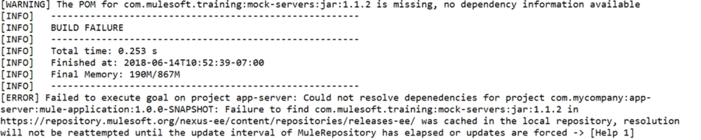

- A. Add the dependency to the MULE_HOME/bin folder
- B. Edit the dependency in the Mule project’s pom.xml file
- C. Deploy the dependency to MuleSoft’s Maven repository
- D. Install the dependency to the computer’s local Maven repository
- **Correct Answer:**
    
    > D
    >

**Explained**

---

### Question 61

In the requestFlow an HTTP Request operation is configured to send an HTTP request with an XML payload. The request is sent to the HTTP Listener in the transformFlow.

That flow transforms the incoming payload into JSON format and returns the response to the HTTP request. The response of the request is stored in a target variable named theResult.

What is the payload at the Logger component after the HTTP Request?

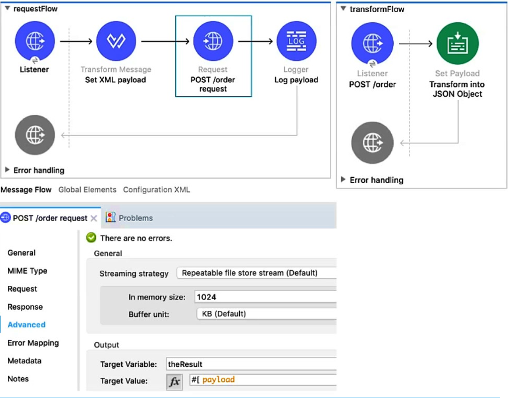

- A. A non-empty Java object
- B. The original XML payload
- C. The returned JSON response
- D. null
- **Correct Answer:**
    
    > B
    >

**Explained**

---

### Question 62

A function named newProdCode needs to be defined that accepts two input parameters, an integer value for ItemID and a string value for productCategory, and returns a new product code.
What is the correct DataWeave code to define the newProdCode function?

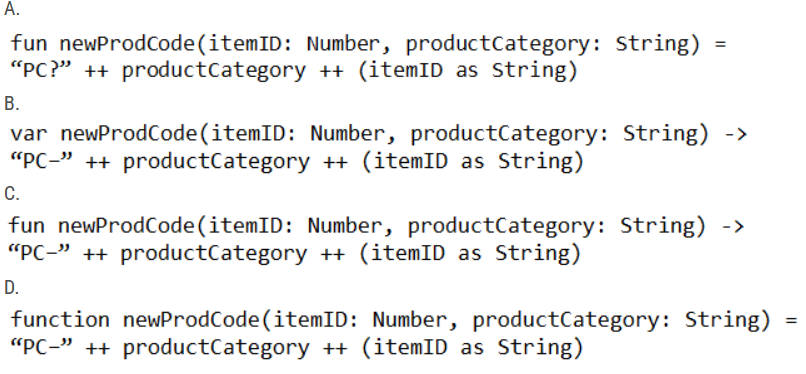


- **Correct Answer:**
    
    > A
    > 
    
    In DAtaWeave 2.0, named fucntions use = not → :
    
    ```java
    ````
    fun newProdCode(itemID: Number, productCategory: String) =
    "PC?" ++ productCategory ++ (itemID as String)
    
    ```

**Explained**

---

### Question 63

What can be added to the flow to persist data across different flow executions?

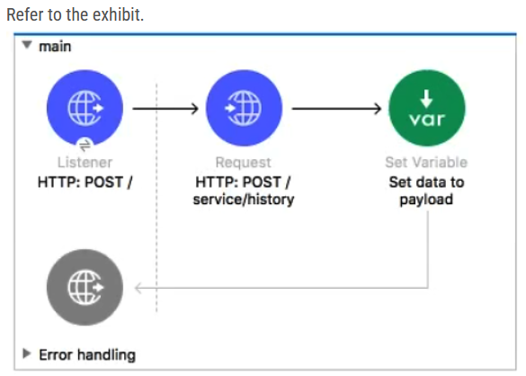

- A. Properties of the Mule runtime app object
- B. Key/value pairs in the ObjectStore
- C. Session variables
- D. Properties of the Mule runtime flow object
- **Correct Answer:**
    
    > B
    >

**Explained**

---

### Question 64

A web client sends a new order record {`oid`: `100`, `custId`: `annie@acme.com`, `status`: `NEW ORDER` } in the payload of a POST request to the Mule application.
What value must be used in the Input Parameters field of the Database Insert operation to properly pass the order record values to the SQL statement?

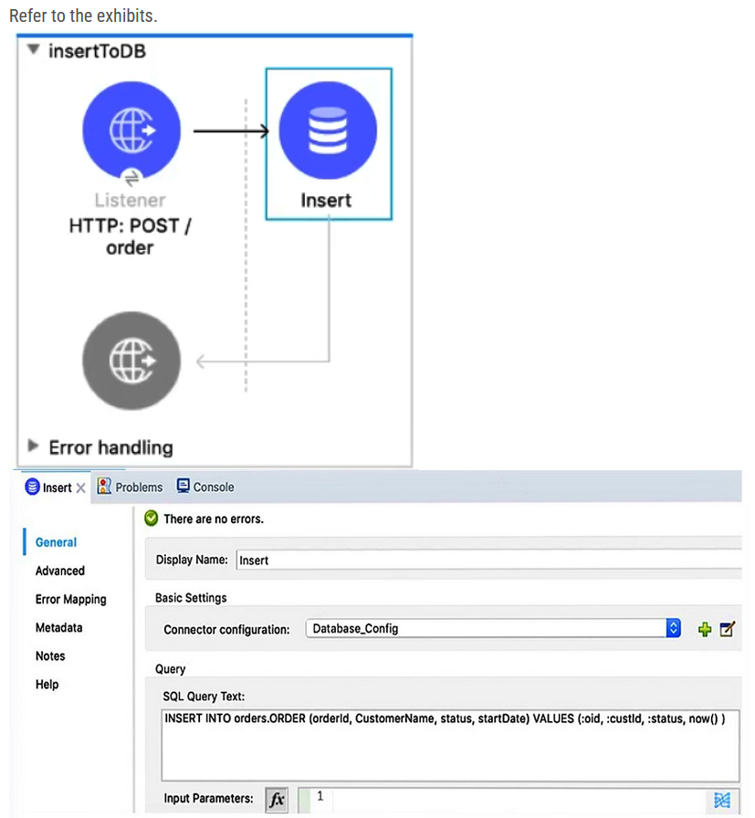
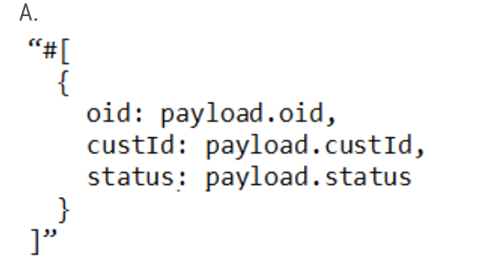
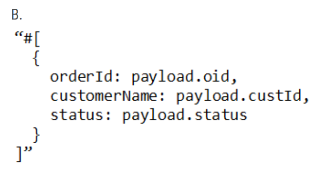
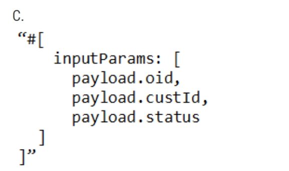
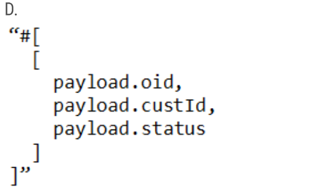

- **Correct Answer:**
    
    > A
    >

**Explained**

---

### Question 65

A Database On Table Row listener retrieves data from a CUSTOMER table that contains a primary key user_id column and an increasing login_date_time column. Neither column allows duplicate values.

How should the listener be configured so it retrieves each row at most one time?

- A. Set the watermark column to the login_date_time column
- B. Set the target value to the last retrieved login_date_time value
- C. Set the target value to the last retrieved user_id value
- D. Set the watermark column to the user_id column

- **Correct Answer:**
    
    > A
    >

**Explained**

---

### Question 66

A company has an API to manage purchase orders, with each record identified by a unique purchase order ID. The API was built with RAML according to
MuleSoft best practices.

What URI should a web client use to request order PO5555?

- A. /orders/{PO5555}
- B. /orders/order=PO5555
- C. /orders?order=PO5555
- D. /orders/PO5555
- **Correct Answer:**
    
    >D
    >

**Explained**

---

### Question 67

The main flow contains an HTTP Request. The HTTP Listeners and HTTP Request use default configurations.
A web client sends a GET request to the main flow’s HTTP Listener that includes a modelName query parameter.
What values are accessible in the child flow?

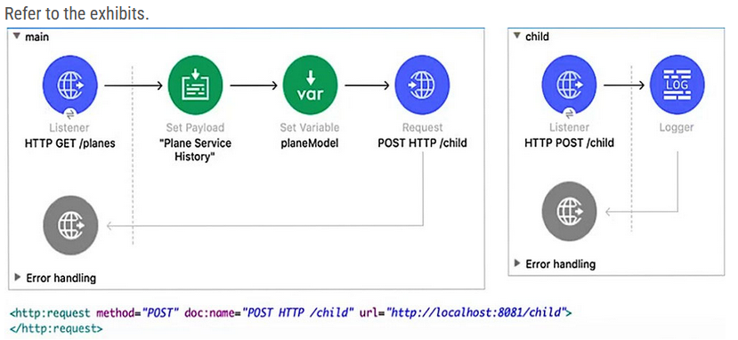


- A. payload
- B. payload, modelName query param
- C. payload, planeModel var
- D. payload, modelName query param, planeModel var
- **Correct Answer:**
    
    > A
    >

**Explained**

---

### Question 68

In the execution of the Scatter-Gather, the `sleep 1 sec` Flow Reference takes about 1 second to complete, and the `sleep 5 secs` Flow Reference takes about 5 seconds to complete.

About how many seconds does it take from the time the Scatter-Gather is called until Set Payload transformer is called?

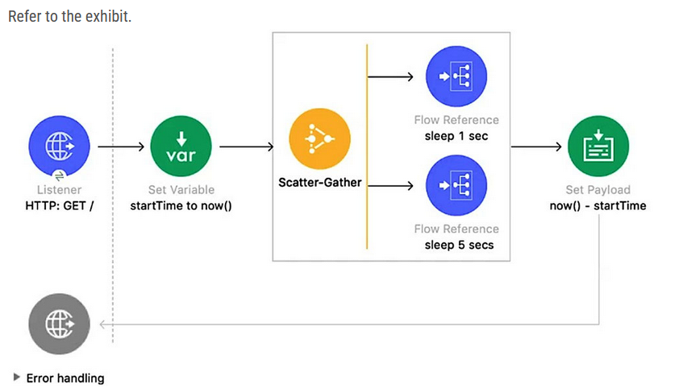

- A. 0
- B. 1
- C. 5
- D. 6
- **Correct Answer:**
    
    > C
    >

**Explained**

---

### Question 69

A web client sends a request to **http://localhost:8081?dept=sales**.
What is the correct DataWeave expression to access the value of dept?

- A. attributes.queryParams.dept
- B. attributes.dept
- C. message.queryParams.dept
- D. vars.dept
- **Correct Answer:**
    
    > A
    >

**Explained**

---

### Question 70

The Mule application has multiple HTTP Listeners contained in various configuration XML files. Each HTTP Listener is configured with the same host and with the port number, path, and operation shown in its display name.

What is the minimum number of global elements that must be defined to support all these HTTP Listeners?

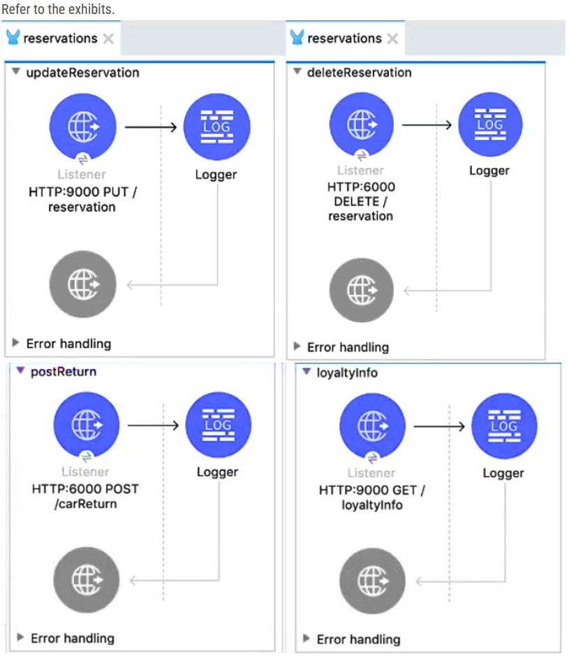

- A. 1
- B. 2
- C. 3
- D. 4
- **Correct Answer:**
    
    > B
    >

**Explained**

---

### Question 71


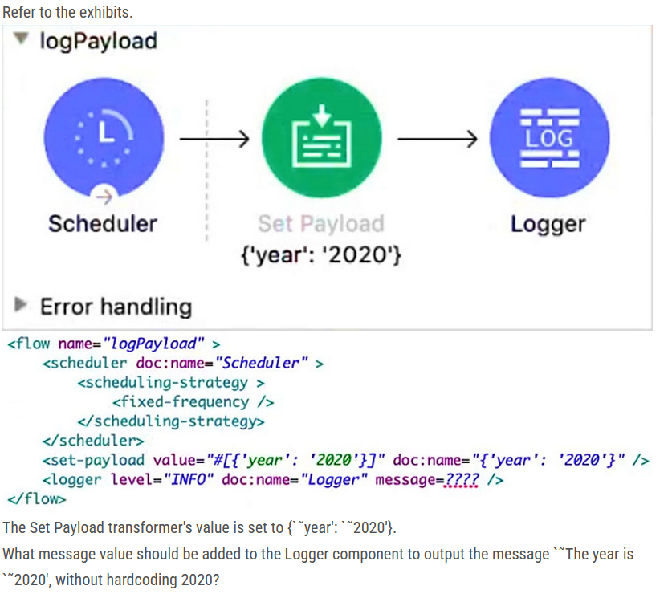

- A. ‘The year is #[payload.year]’
- B. ‘#[The year is $(payload.year)]’
- C. ‘#[“The year is ++ payload.year”]’
- D. ‘#[“The year is” + payload.year]’
- **Correct Answer:**
    
    > A
    >

**Explained**

---

### Question 72

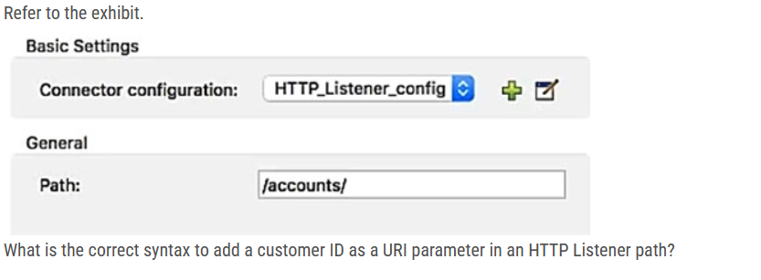

- A. (customerID)
- B. #[customerID]
- C. {customerID}
- D. ${customerID}
- **Correct Answer:**
    
    > C
    >

**Explained**

---

### Question 73

A web client sends a POST request to the HTTP Listener and the Validation component in the Try scope throws an error.
What response message is returned to the web client?

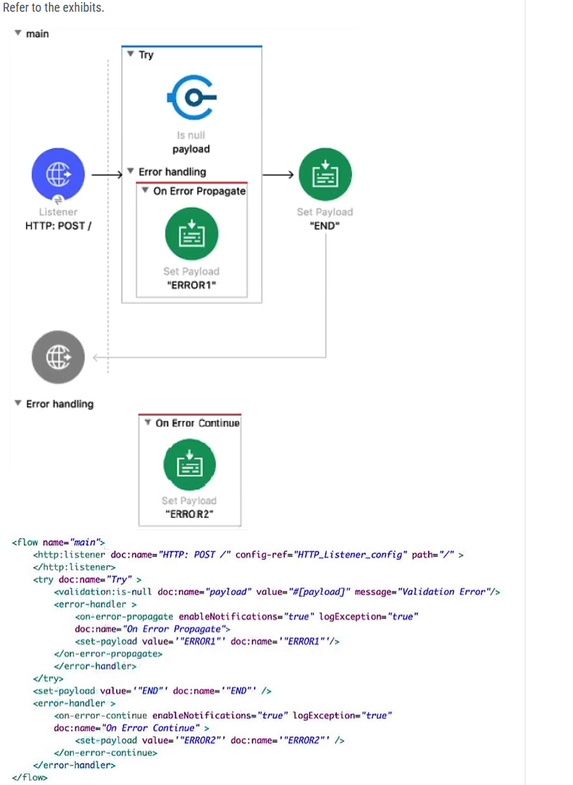

- A. Validation Error
- B. “END”
- C. “ERROR1”
- D. “ERROR2”
- **Correct Answer:**
    
    > D
    >

**Explained**

---

### Question 74

What execution model is used by For Each and Batch Job scopes?

- A. Both are multi-threaded
- B. Both are single-threaded
- C. Batch Job is single-threaded and For Each is multi-threaded
- D. For Each is single-threaded and Batch Job is multi-threaded
- **Correct Answer:**
    
    > D
    >

**Explained**

---

### Question 75

A web client sends a POST request to the HTTP Listener with the payload `Hello-`.
What response is returned to the web client?

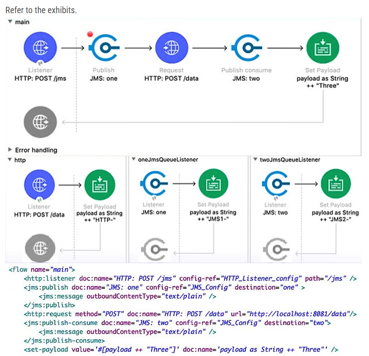

- A. Hello-HTTP-JMS2-Three
- B. HTTP-JMS2-Three
- C. Hello-JMS1-HTTP-JMS2-Three
- D. Hello-HTTP-Three
- **Correct Answer:**
    
    > A
    >

**Explained**

---

### Question 76

An API implementation has been deployed to CloudHub and now needs to be governed. IT will not allocate additional vCores for a new Mule application to act as an API proxy.

What is the next step to preserve the current vCore usage, but still allow the Mule application to be managed by API Manager?

- A. Modify the API implementation to use auto-discovery to register with API Manager
- B. Deploy the same API implementation behind a VPC and configure the VPC to connect to API Manager
- C. Upload the Mule application’s JAR file to the API instance in API Manager
- D. Register the same API implementation in Runtime Manager to connect to API Manager
- **Correct Answer:**
    
    > A
    >

**Explained**

---

### Question 77

This RAML specification includes a resource and method to retrieve accounts by account_type and industry.
What is the correct URI to get all retail finance accounts?

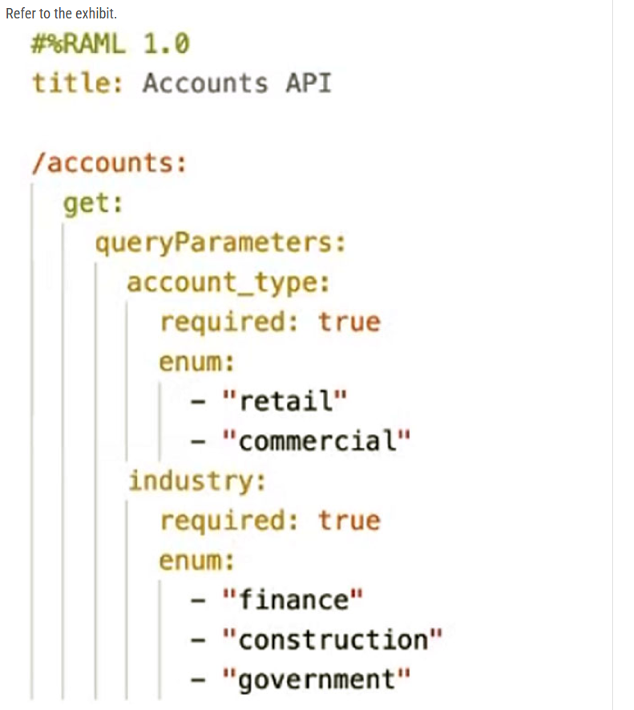

- A. /accounts?account_type:retail&industry:finance
- B. /accounts/retail/finance
- C. /accounts/account_type=retail/industry=finance
- D. /accounts?account_type=retail&industry=finance
- **Correct Answer:**
    
    > D
    >

**Explained**

---

### Question 78


This Mule application has an HTTP Request that is configured with hardcoded values. To change this, the Mule application is configured to use a properties file named config.yaml.
What valid expression can the HTTP Request host value be set to so that it is no longer hardcoded?

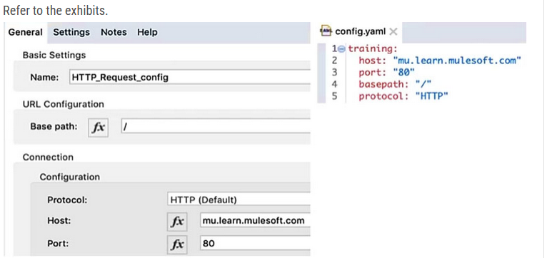

- A. ${training:host}
- B. #[training.host]
- C. ${training.host}
- D. #[training.host]
- **Correct Answer:**
    
    > C
    >

**Explained**

---

### Question 79

To avoid hard-coding values, a flow uses some property placeholders and the corresponding values are stored in a configuration file.
Where does the configuration file’s location need to be specified in the Mule application?

- A. A global element
- B. The mule-artifact.json file
- C. A flow attribute
- D. The pom.xml file
- **Correct Answer:**
    
    > A
    >

**Explained**

---

### Question 80

The main flow contains an HTTP Request in the middle of the flow. The HTTP Listeners and HTTP Request use default configurations.
A web client sends a GET request to the main flow’s HTTP Listener. The GET request includes query for the pedigree of a piano.
What values are accessible to the Logger component at the end of the main flow?

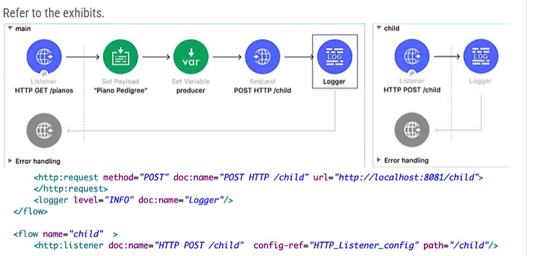

- A. payload
- B. payload, pedigree query params
- C. payload, producer var
- D. payload, pedigree query params, producer var
- **Correct Answer:**
    
    > C
    >

**Explained**

---


### Question 81

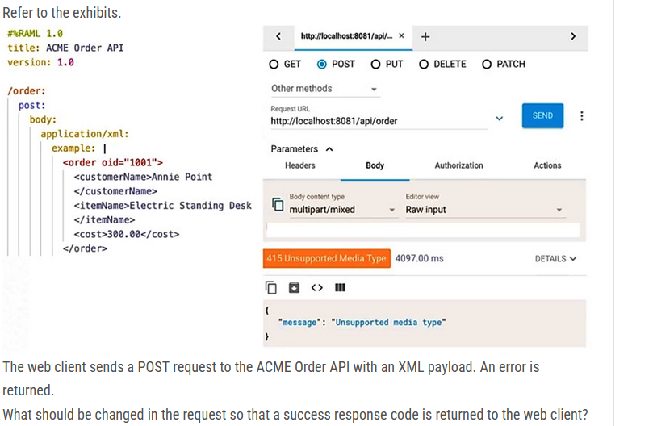

- A. Set a request header with the name Content-Type to a value of application/octet-stream
- B. Set a request header with the name Content-Type to a value of application/xml
- C. Set a response header with the name Content-Type to a value of application/xml
- D. Set a response header with the name Content-Type to a value of application/octet-stream
- **Correct Answer:**
    
    > B
    >

**Explained**

---

### Question 82


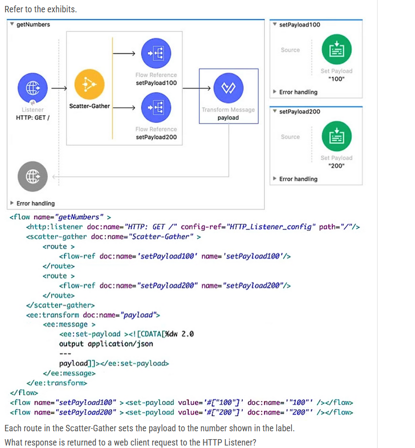
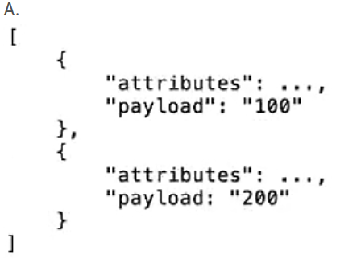
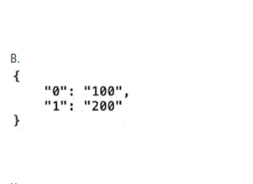
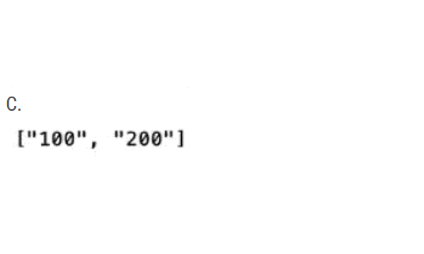
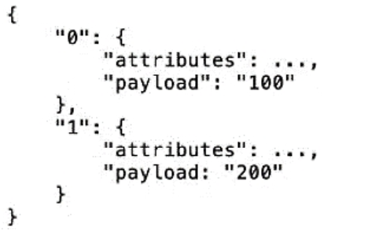

- **Correct Answer:**
    
    > C
    >

**Explained**

---

### Question 83

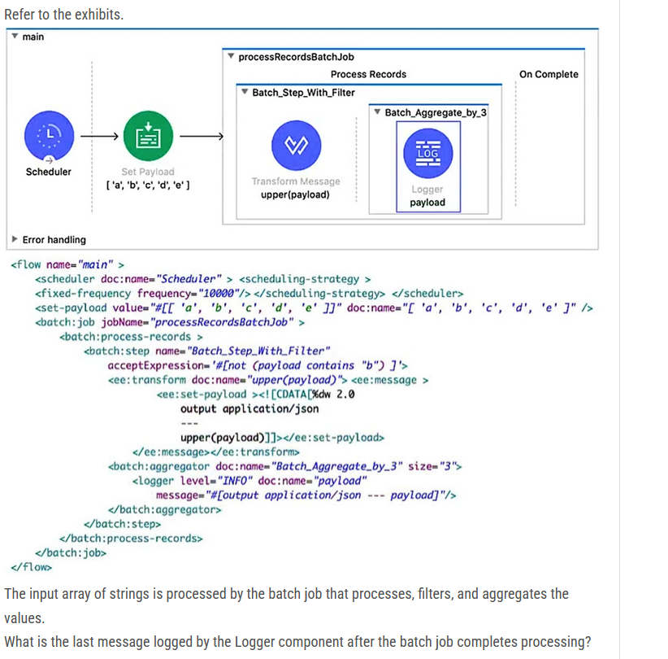

- A. [ [“A”, “C”, “D”], [“E”] ]
- B. [ “E” ]
- C. [ “D”, “E” ]
- D. [ “A”, “C”, “D”, “E” ]
- **Correct Answer:**
    
    > B
    >

**Explained**

---

### Question 84

The Mule application is debugged in Anypoint Studio and stops at the breakpoint.
What is the value of the payload displayed in the debugger at this breakpoint?

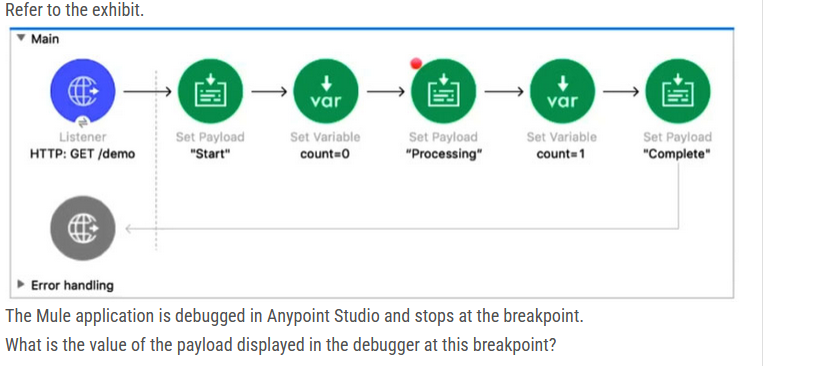

- A. 0
- B. “Processing”
- C. “Start”
- D. “Complete”
- **Correct Answer:**
    
    > C *(community voted C; listed answer is D)*
    >

**Explained**

---

### Question 85

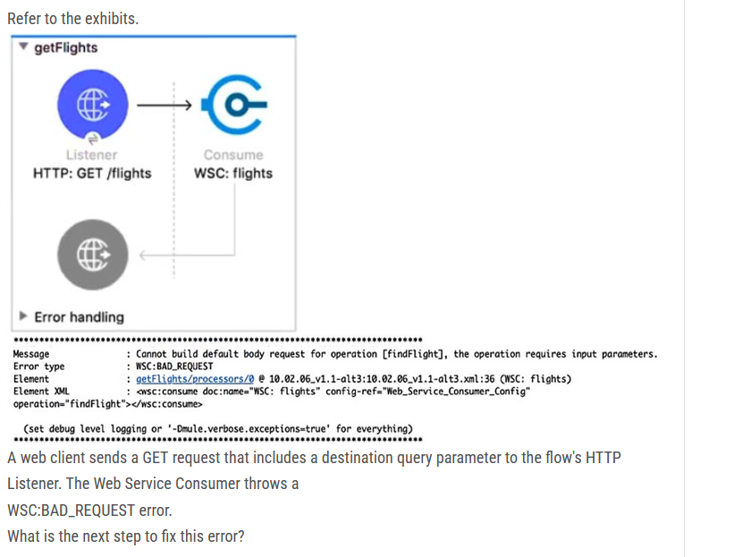


- A. Set a header in the Consume operation equal to the destination query parameter
- B. Set a SOAP payload before the Consume operation that contains the destination query parameter
- C. Set a property in the Consume operation equal to the destination query parameter
- D. Set a JSON payload before the Consume operation that contains the destination query parameter
- **Correct Answer:**
    
    > B *(community voted B)*
    >

**Explained**

---

### Question 86

What DataWeave expression transforms the conductorIds array to the XML output?

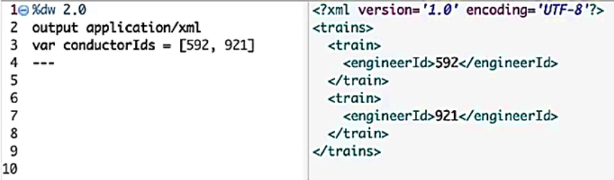
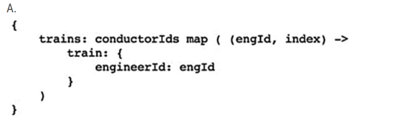
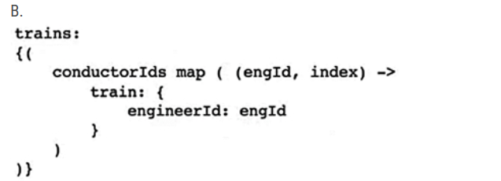
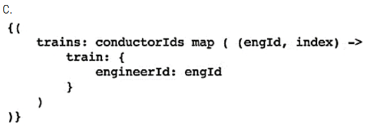
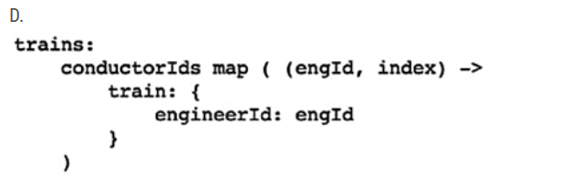


- **Correct Answer:**
    
    > D
    >

**Explained**

---

### Question 87

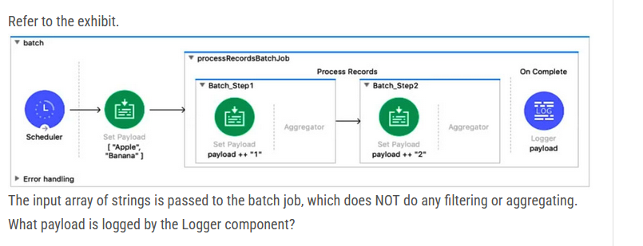

- A. Summary report of processed records
- B. [ “Apple”, “Banana” ]
- C. [ “Apple12”, “Banana12” ]
- D. [ “Apple1”, “Banana1”, 2 ]
- **Correct Answer:**
    
    > C
    >

**Explained**

---

### Question 88

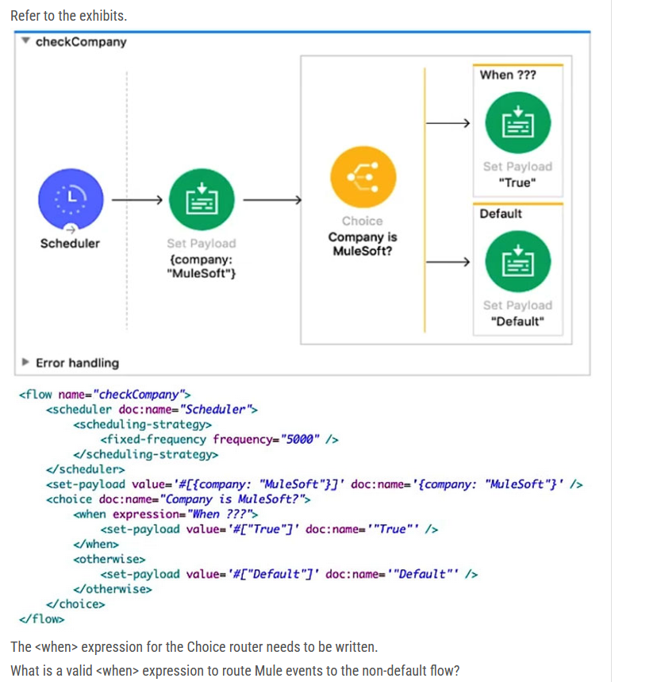

- A. #[ ‘MuleSoft’ == payload.’company’ ]
- B. #[ if ( ‘MuleSoft’ == payload.company ) ]
- C. #[ company = “MuleSoft” ]
- D. #[ if( company = “MuleSoft” ) ]
- **Correct Answer:**
    
    > A *(community voted A)*
    >

**Explained**

---

### Question 89

By default, what happens to a file after it is read using an FTP connector Read operation?

- A. The file is moved to a different folder
- B. The file stays in the same folder unchanged
- C. The file is renamed in the same folder
- D. The file is deleted from the folder
- **Correct Answer:**
    
    > B
    >

**Explained**

---

### Question 90

An API specification is designed using RAML. What is the next step to create a REST Connector from this API specification?

- A. Add the specification to a Mule project’s src/main/resources/api folder
- B. Implement the API specification using flow designer in Design Center
- C. Download the API specification and build the interface using APIkit
- D. Publish the API specification to Anypoint Exchange
- **Correct Answer:**
    
    > D
    >

**Explained**

---

### Question 91

A Mule event is composed of a hierarchy of objects.
Where in the hierarchy are variables stored?

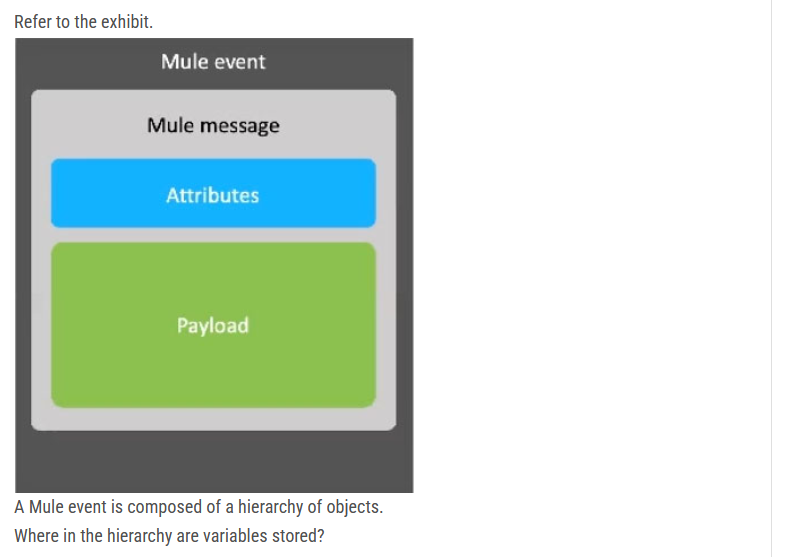

- A. Mule message attributes
- B. Mule message
- C. Mule message payload
- D. Mule event
- **Correct Answer:**
    
    > D *(variables are stored at the Mule event level)*
    >

**Explained**

---

### Question 92

A flow needs to combine and return data from two different data sources. It contains a Database SELECT operation followed by an HTTP Request operation.
What is the method to capture both payloads so the payload from the second request does not overwrite that from the first?

- A. Save the payload from the Database SELECT operation to a variable.
- B. Put the Database SELECT operation inside a Cache scope
- C. Put the Database SELECT operation inside a Message Enricher scope
- D. Nothing, previous payloads are combined into the next payload
- **Correct Answer:**
    
    > A
    >

**Explained**

---

### Question 93

A Mule application contains a global error handler configured to catch any errors.
Where must the global error handler be specified so that the global error handler catches all errors from flows without their own error handlers?

- A. A global element
- B. The pom.xml file
- C. Nowhere, the global error handler is automatically used
- D. A configuration properties file
- **Correct Answer:**
    
    > A
    >

**Explained**

---

### Question 94


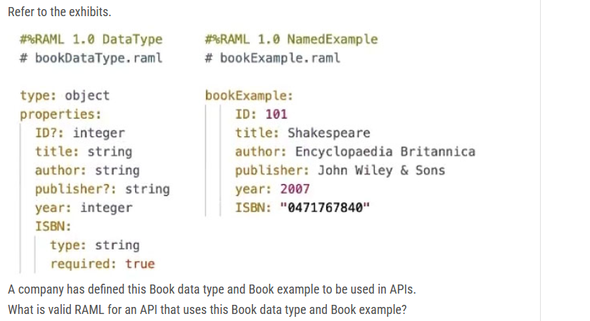

1.

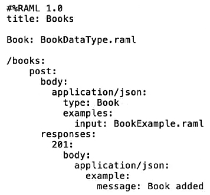


1.

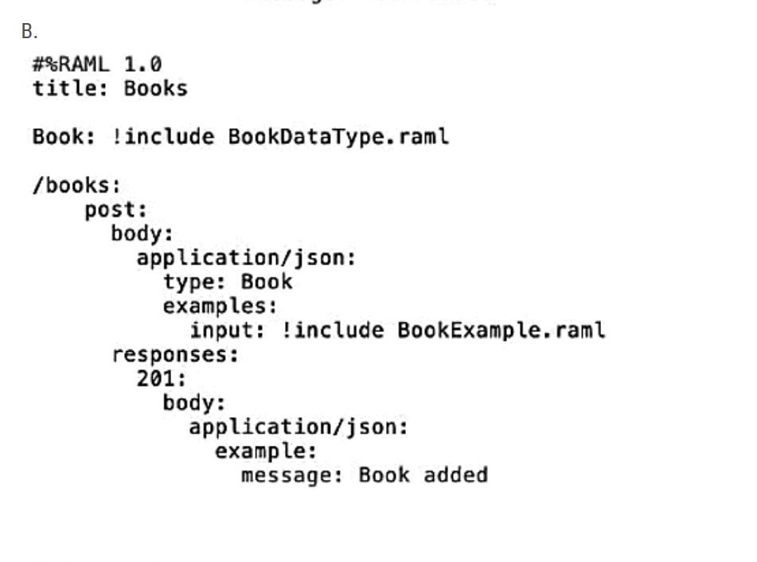


1.

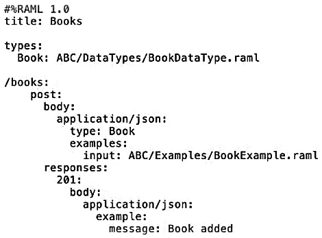


1.

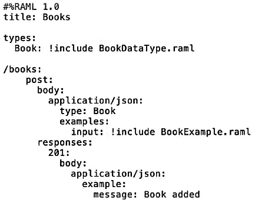


- **Correct Answer:**
    
    > A
    >

**Explained**

---

### Question 95


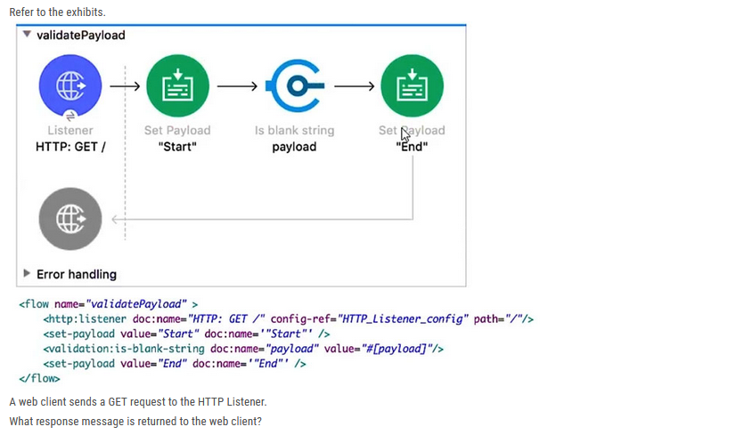


- A. “”
- B. “End”
- C. “Start”
- D. “String is not blank”
- **Correct Answer:**
    
    > D
    >

**Explained**

---

### Question 96

How many private flows does APIkit generate from the RAML specification?

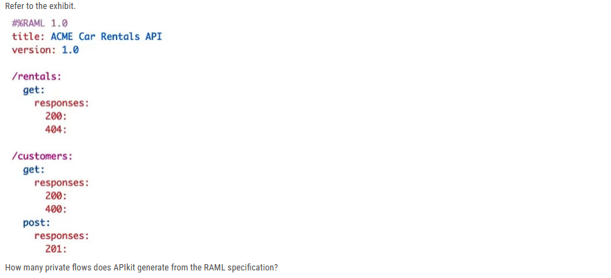


- A. 1
- B. 2
- C. 3
- D. 5
- **Correct Answer:**
    
    > C *(community voted C)*
    >

**Explained**

---

### Question 97

A web client 

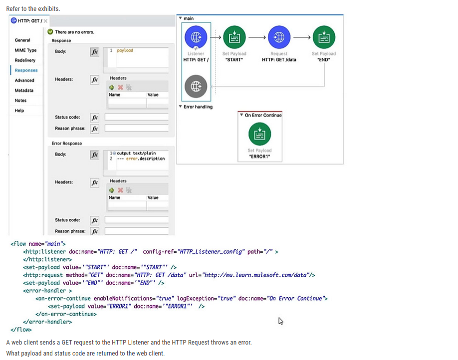


- A. Response body: “START” — Default response status code: 200
- B. Response body: “ERROR1” — Default response status code: 200
- C. Response body: “END” — Default response status code: 200
- D. Error response body: error.description — Default error response status code: 500

- **Correct Answer:**
    
    > D
    >

**Explained**

---

### Question 98

What is the output type of the DataWeave map operator?

- A. Object
- B. Array
- C. Map
- D. String
- **Correct Answer:**
    
    > B *(community voted B)*
    >

**Explained**

---

### Question 99

A Mule project contains a DataWeave module called MyModule.dwl that defines a function named formatString. The module is located in the project’s src/main/ resources/modules folder.

What is the correct way in DataWeave code to import MyModule using a wildcard and then call the module’s formatString function?

1.

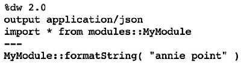

1.

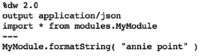

1.

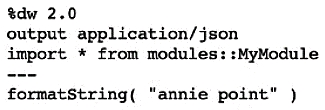

1.

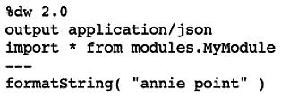


- **Correct Answer:**
    
    > A

**Explained**

---

### Question 100
The validation component in the private flow throws an error.
Waht response message is returned to a web client request to the main flow's HTTP Listener?

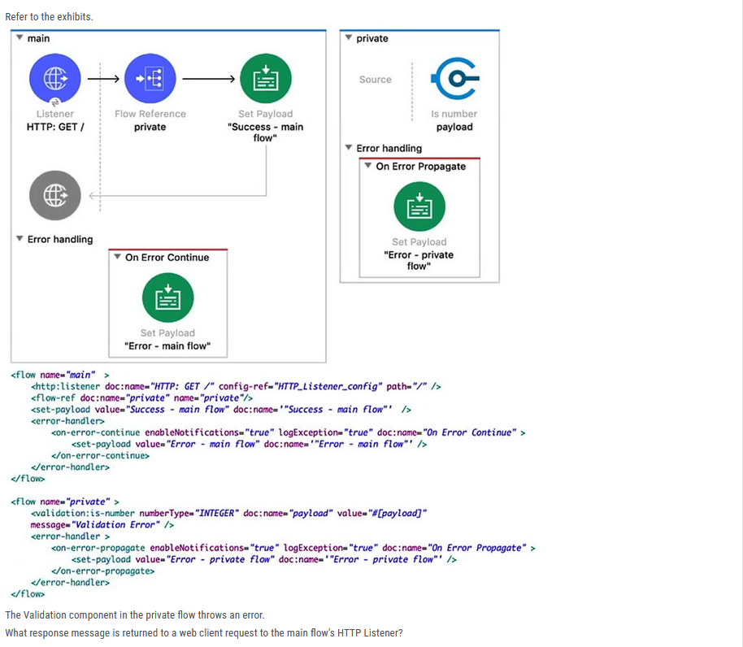


- A. Error - private flow
- B. Validation Error
- C. Error - main flow
- D. Success - main flow
- **Correct Answer:**
    
    > C
    >

**Explained**


---

### Question 101
What payload and quantity are logged at the end of the main flow?

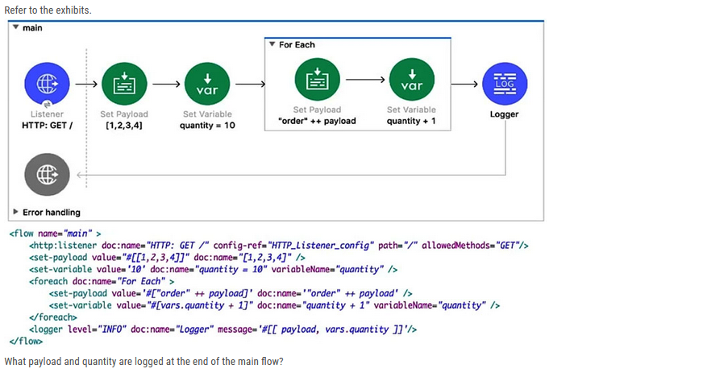


- A. [[order1, order2, order3, order4], 14]
- B. [[1,2,3,4], 10]
- C. [[1,2,3,4], 14]
- D. [order1order2order3order4, 14]
- **Correct Answer:**
    
    > C
    > 
    
    **Key rule:** For Each restores the **payload** after completion, but **variables persist!**

**Explained**

---

### Question 102

What data is expected by the POST /accounts endpoint?


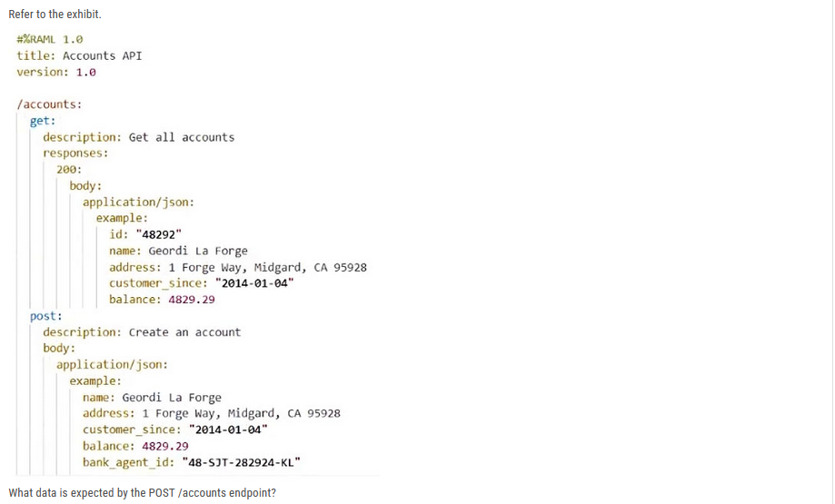


1. 

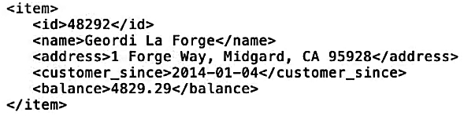


1. 

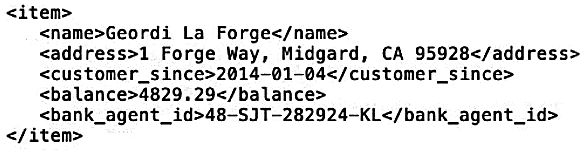


1. 

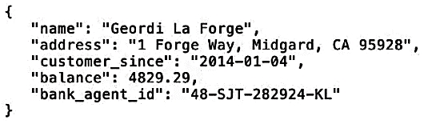


1. 

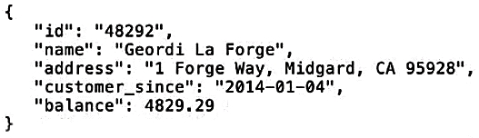


- **Correct Answer:**
    
    >  C

**Explained**

---

### Question 103


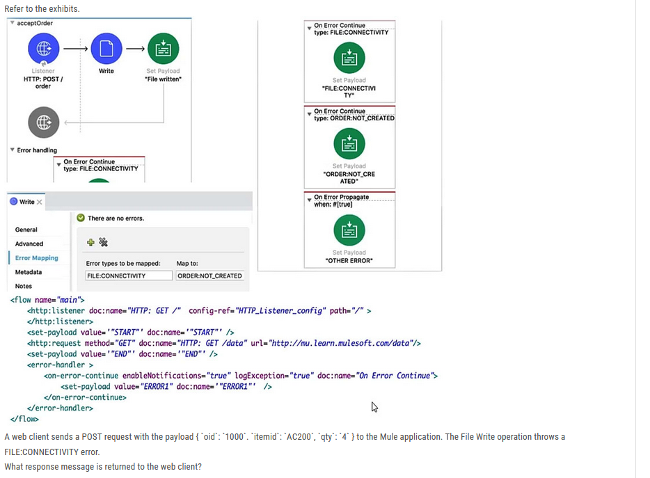

- A. “[FILE:CONNECTIVITY”](file:///CONNECTIVITY%E2%80%9D)
- B. “ORDER:NOT_CREATED”
- C. “OTHER ERROR”
- D. “File written”
- **Correct Answer:**
    
    > B
    >

**Explained**

A web client sends a POST request with the payload {'old': '1000', 'itemid': }

---

### Question 104


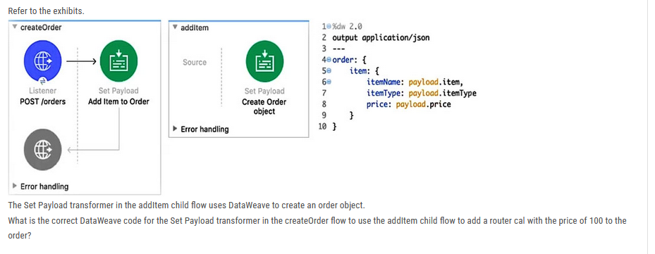


- A. lookup( “addItem”, { price: “100”, item: “router”, itemType: “cable” } )
- B. addItem( { payload: { price: “100”, item: “router”, itemType: “cable” } } )
- C. lookup( “addItem”, { payload: { price: “100”, item: “router”, itemType: “cable” } } )
- D. addItem( { price: “100”, item: “router”, itemType: “cable” } )
- **Correct Answer:**
    
    > A
    >

**Explained**

---

### Question 105

A JSON payload is set in the Set Payload transformer.

What is logged by the Logger?

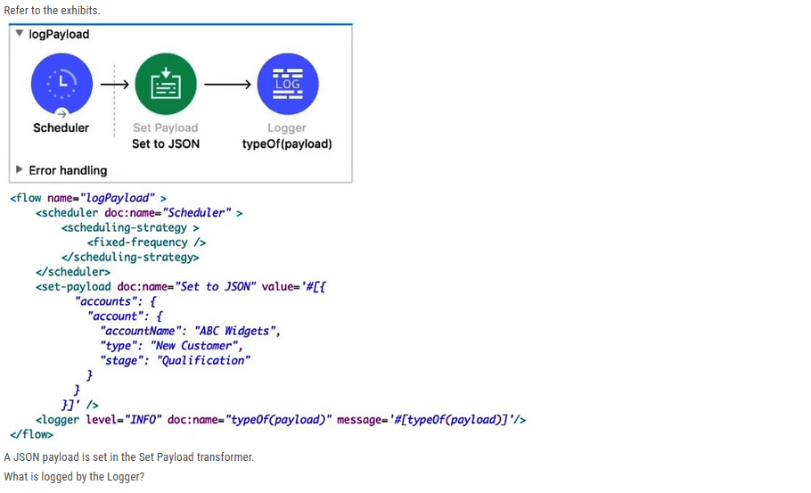

- A. “String”
- B. “Object”
- C. “Array”
- D. “JSON”
- **Correct Answer:**
    
    > B
    > 
    
    ## Answer: **B. "Object"**
    
    ### Key Concept: typeOf() returns DataWeave type, not format
    
    The Set Payload uses a **DataWeave expression** `#[{...}]` which creates an **Object in memory** — not a JSON string.
    
    ---
    
    ### 🔑 Object vs JSON Syntax
    
    |  | Object (DataWeave) | JSON (String) |
    | --- | --- | --- |
    | **What it is** | Data structure in memory | Text format |
    | **Syntax** | `#[{ "key": "value" }]` | `'{"key": "value"}'` |
    | **typeOf()** | `"Object"` ✅ | `"String"` |
    | **Example** | `#[{ name: "John" }]` | `'{"name":"John"}'` |
    
    ---
    
    ### Simple analogy 🧠
    
    `JSON   = a letter written on paper  (text)
    Object = the actual information 
             living in your brain       (memory)`
    
    ---
    
    ### In this flow:
    
    dataweave
    
    `// This is a DataWeave OBJECT (in memory)
    #[{
      "accounts": {
        "account": { ... }
      }
    }]
    
    typeOf(payload) → "Object" ✅`
    
    dataweave
    
    `// This would be a STRING (JSON text)
    '{"accounts": {"account": {...}}}'
    
    typeOf(payload) → "String"`
    
    ---
    
    ### Why not the others?
    
    | Option | Why wrong |
    | --- | --- |
    | A. String | Only if set with quotes `'...'` |
    | C. Array | No `[ ]` at root level |
    | D. JSON | JSON is a **format**, not a DataWeave type |
    
    > 💡 **Rule:** `#[{...}]` = **Object** in memory. Only becomes JSON when you set `output application/json`!
    >

**Explained**

---

### Question 106

An SLA based policy has been enabled in API Manager.
What is the next step to configure the API proxy to enforce the new SLA policy?

- A. Restart the API proxy to clear the API policy cache
- B. Add new property placeholders and redeploy the API proxy
- C. Add required headers to the RAML specification and redeploy the new API proxy
- D. Add new environment variables and restart the API proxy
- **Correct Answer:**
    
    > C
    > 
    
    [https://docs.mulesoft.com/gateway/latest/policies-included-rate-limiting-sla](https://docs.mulesoft.com/gateway/latest/policies-included-rate-limiting-sla)

**Explained**

---

### Question 107


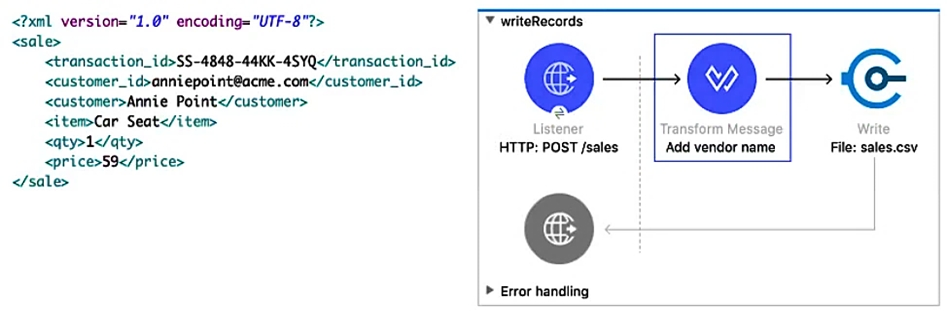


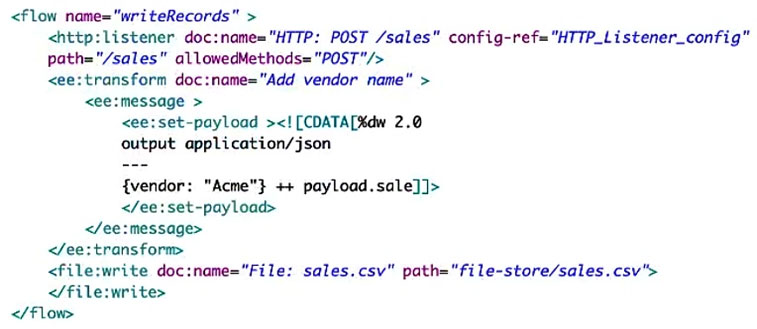


A web client sends sale data in a POST request to the Mule application. The Transform Message component then enriches the payload by prepending a vendor name to the sale data.
What is written to the sales.csv file when the flow executes?

- A. The enriched payload in JSON format
- B. The enriched payload in XML format
- C. The enriched payload in CSV format
- D. An error message
- **Correct Answer:**
    
    > A/D?
    > 
    
   
    ### Step 1: Incoming XML payload
    
    xml
    
    `<sale>
        <transaction_id>SS-4848...</transaction_id>
        <customer>Annie Point</customer>
        <item>Car Seat</item>
        <price>59</price>
    </sale>`
    
    ### Step 2: Transform Message
    
    dataweave
    
    `%dw 2.0
    output application/json  // ← OUTPUT is JSON!
    ---
    {vendor: "Acme"} ++ payload.sale  // merges vendor + sale data`
    
    **Result:**
    
    json
    
    `{
      "vendor": "Acme",
      "transaction_id": "SS-4848...",
      "customer": "Annie Point",
      "item": "Car Seat",
      "price": "59"
    }`
    
    ### Step 3: File Write
    
    xml
    
    `<file:write path="file-store/sales.csv">`
    
    ⚠️ The file write has **no output format config** — it writes **whatever payload it receives** = JSON!
    
    ---
    
    ### Why not the others?
    
    | Option | Why wrong |
    | --- | --- |
    | B. XML | Transform outputs `application/json`, not XML |
    | C. CSV | No CSV conversion defined anywhere |
    | D. Error | `++` merge works fine with XML→JSON |
    
    > 💡 **Key rule:** The **file extension** (`.csv`) does NOT automatically convert the content — the format is determined by the **DataWeave output directive**, which is `application/json`!
    >

**Explained**

---

### Question 108

According to MuleSoft, what is the first step to create a Modern API?

- A. Performance tune and optimize the backend systems and network
- B. Create an API specification and get feedback from stakeholders
- C. Create a prototype of the API implementation
- D. Gather a list of requirements to secure the API
- **Correct Answer:**
    
    > B
    >

**Explained**

---

### Question 109

An app team is developing a mobile banking app. It took them two months to create their own APIs to access transaction information from a central database. The app team later found out that another team had already built an API that accesses the transaction information they need.
According to MuleSoft, what organization structure could have saved the app team two months of development time?

- A. Center for Enablement
- B. Center of Excellence
- C. Central API Review Board
- D. MuleSoft Support Center
- **Correct Answer:**
    
    > A
    > 
    
    [https://blogs.mulesoft.com/biz/connectivity/what-is-a-center-for-enablement-c4e/](https://blogs.mulesoft.com/biz/connectivity/what-is-a-center-for-enablement-c4e/)

**Explained**

---

### Question 110

Why would a Mule application use the ${http.port} property placeholder for its HTTP Listener port when it is deployed to CloudHub?

- A. Allows CloudHub to automatically change the HTTP port to allow external clients to connect to the HTTP Listener
- B. Allows clients to VPN directly to the application at the Mule application’s configured HTTP port
- C. Allows MuleSoft Support to troubleshoot the application by connecting directly to the HTTP Listener
- D. Allows CloudHub to automatically register the application with API Manager
- **Correct Answer:**
    
    > A
    > 
    
    [https://docs.mulesoft.com/runtime-manager/developing-applications-for-cloudhub](https://docs.mulesoft.com/runtime-manager/developing-applications-for-cloudhub)

**Explained**

---

### Question 111

A Mule application contains an ActiveMQ JMS dependency. The Mule application was developed in Anypoint Studio and runs successfully in Anypoint Studio.
The Mule application must now be exported from Anypoint Studio and shared with another developer.
What export options create the smallest JAR file that can be imported into the other developer’s Anypoint Studio and run successfully?

1. 


1. 


1. 


1. 


- **Correct Answer:**
    
    > B
    >

**Explained**

---

### Question 112

In an application network, if the implementation but not the interface of a product API changes, what needs to be done to the other APIs that consume the product API?

- A. The applications associated with the other APIs must be restarted
- B. The other APIs must be updated to consume the updated product API
- C. Nothing needs to be changed in the other APIs or their associated applications
- D. The applications associated with the other APIs must be recoded
- **Correct Answer:**
    
    > B
    >

**Explained**

---

### Question 113

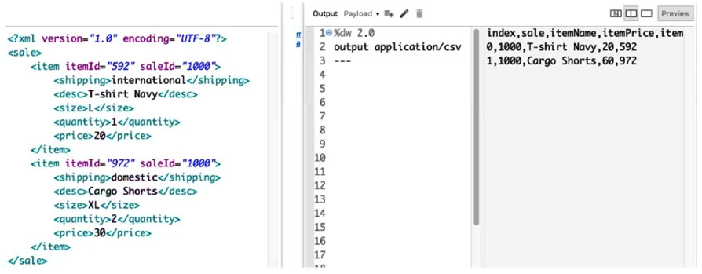
What DataWeave expression transforms the example XML input to the CSV output?


1. 

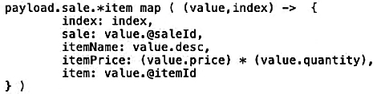


1. 

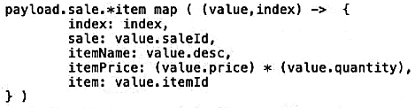


1. 

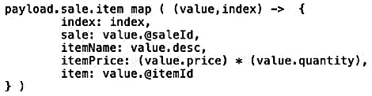


1. 

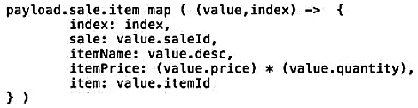


- **Correct Answer:**
    
    > A
    >

**Explained**

---

### Question 114


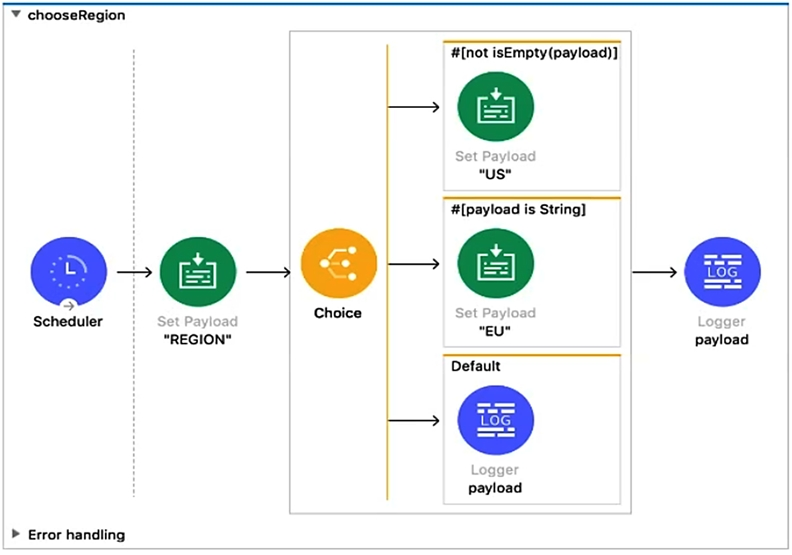

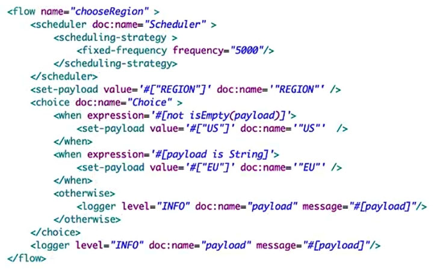


The Mule application contains a Choice router. What is logged when the flow completes?

- A. US
- B. “REGION”
- C. EU
- D. [“US”, “EU”]
- **Correct Answer:**
    
    > A
    > 
    
    ## Answer: **A. US**
    
    ### Tracing the flow step by step:
    
    ---
    
    ### Step 1: Set Payload
    
    `payload = "REGION"  (a non-empty String)`
    
    ### Step 2: Choice Router — evaluates conditions **in order**:
    
    `Condition 1: #[not isEmpty(payload)]
                 not isEmpty("REGION") = TRUE ✅
                 → Sets payload = "US"
                 → STOPS here! (no more conditions checked)`
    
    > Choice router works like **if/else if** — **first match wins!**
    > 
    
    ---
    
    ### Step 3: Logger (after Choice)
    
    `payload = "US" ✅`
    
    ---
    
    ### Why Condition 2 never runs:
    
    `#[payload is String] 
    → would also be TRUE for "REGION"
    → BUT never reached because Condition 1 
       already matched!`
    
    ### Why not the others?
    
    | Option | Why wrong |
    | --- | --- |
    | B. "REGION" | Payload was changed to "US" by Choice |
    | C. EU | Condition 2 never evaluated |
    | D. ["US","EU"] | Choice only executes **one** matching route |
    
    > 💡 **Key rule:** Choice router = **first matching condition wins** and exits. It does NOT evaluate all conditions!
    >

**Explained**

---

### Question 115

A web client submits a request to [http://localhost:8081/books/0471767840](http://localhost:8081/books/0471767840). The value ‘`0471767840`’ is captured by a Set Variable transformer to a variable named bookISBN. What is the DataWeave expression to access bookISBN later in the flow?

- A. attributes.bookISBN
- B. flowVars.bookISBN
- C. vars.bookISBN
- D. bookISBN
- **Correct Answer:**
    
    > C
    >

**Explained**

---

### Question 116

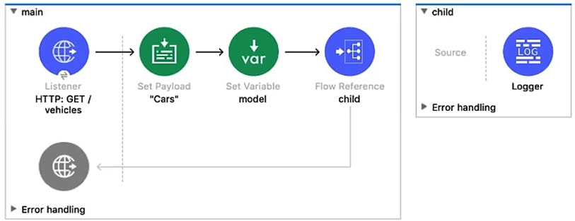

The main flow contains a Flow Reference to the child flow.
A web client sends a GET request to the main flow’s HTTP Listener that includes a make query parameter. What values are accessible in the child flow?

- A. payload
- B. payload, make query param
- C. payload, model var
- D. payload, make query param, model var
- **Correct Answer:**

    > D
    >

    Flow Reference passes the entire Mule Event (payload, variables, and attributes including query params) to the child flow.

**Explained**

---

### Question 117

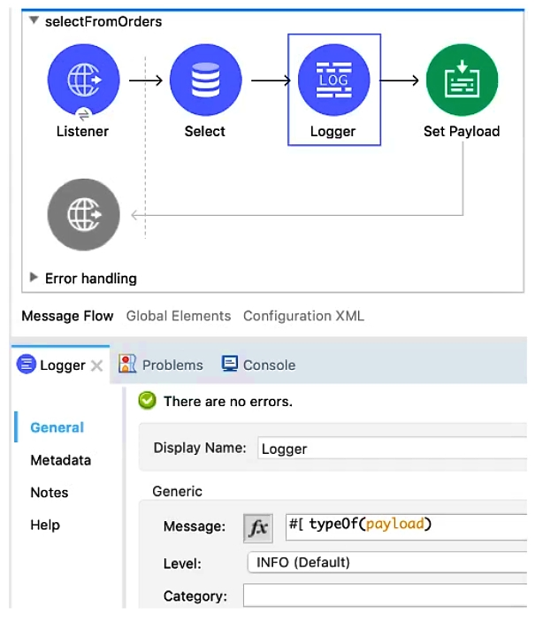


The Database Select operation returns five rows from a database.

What is logged by the Logger component?

- A. “Array”
- B. “Object”
- C. “LinkedHashMap”
- D. “CaseInsensitiveHashMap”
- **Correct Answer:**
    
    > A
    > 
    
    Key Rule: Databases return Arrays

**Explained**

---

---

### Question 118

A company has an API to manage departments, with each department identified by a unique deptId. The API was built with RAML according to MuleSoft best practices. What is valid RAML to specify a method to update the details for a specific department?

1.

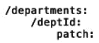

1.

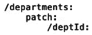

1.

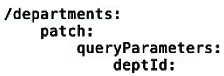

1.

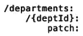

- **Correct Answer:**
    
    > D
    > 
    
    [https://docs.mulesoft.com/design-center/design-common-problems-raml-10](https://docs.mulesoft.com/design-center/design-common-problems-raml-10)

**Explained**

---

### Question 119

Refer to the exhibit. APIkit is used to generate flow components for the RAML specification.

How many APIkit Router components are generated to handle requests to every endpoint defined in the RAML specification?

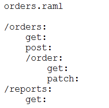

- A. 1
- B. 2
- C. 3
- D. 5
- **Correct Answer:**
    
    > A
    > 
    
    ## Answer: **A. 1**
    
    ### Key Concept: APIkit Router
    
    APIkit generates **ONE single Router component** per RAML spec — it acts as the central dispatcher for ALL endpoints.
    
    ---
    
    ### What APIkit actually generates:
    
    `1 × APIkit Router        ← ONE router only!
    +
    1 × flow per endpoint:
        GET /orders
        POST /orders
        GET /orders/order
        PATCH /orders/order
        GET /reports`
    
    ---
    
    ### How it works:
    
    `All requests
         ↓
    [1 APIkit Router]   ← single entry point
         ↓
    Routes to the correct flow based on:
      - HTTP method (GET, POST, PATCH...)
      - URI path (/orders, /reports...)`
    
    ---
    
    ### Counting endpoints (flows generated = 5):
    
    | Endpoint | Methods |
    | --- | --- |
    | `/orders` | GET, POST |
    | `/orders/order` | GET, PATCH |
    | `/reports` | GET |
    
    ---
    
    ### Why not the others?
    
    | Option | Why wrong |
    | --- | --- |
    | B. 2 | Not one per resource |
    | C. 3 | Not one per resource path |
    | D. 5 | That's the number of **flows**, not routers |
    
    > 💡 **Key rule:** Always **1 APIkit Router** per RAML spec regardless of how many endpoints exist — the router handles ALL routing internally!
    >

**Explained**

---

### Question 120

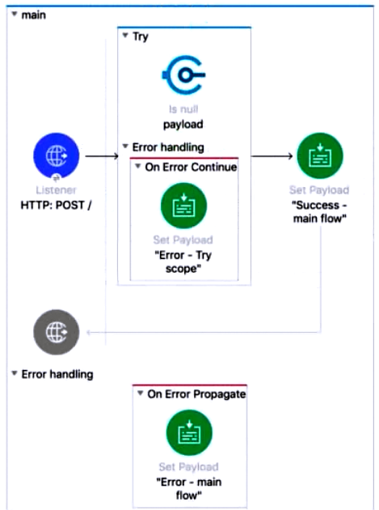

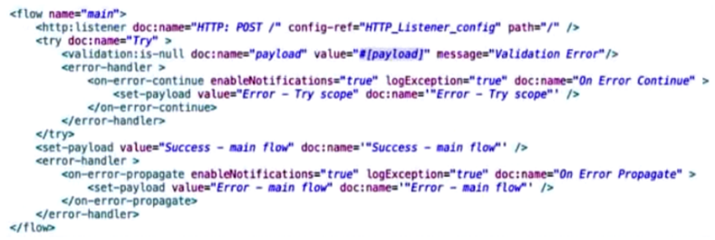

The Validation component in the Try scope throws an error.

What response message is returned to a client request to the main flows HTTP Listener?

- A. “Error – main flow”
- B. “Error – Try scope”
- C. “Success – main flow”
- D. Validation Error
- **Correct Answer:**
    
    > C
    > 
    
    ## Answer: **C. "Success – main flow"**
    
    ### Key Concept: On Error Continue vs On Error Propagate
    
    | Handler | Behaviour |
    | --- | --- |
    | **On Error Continue** | Handles error, flow **continues** after the scope ✅ |
    | **On Error Propagate** | Handles error, flow **stops** and propagates up ❌ |
    
    ---
    
    ### Tracing the flow:
    
    `1. Listener receives request
            ↓
    2. Try scope: Validation throws error ❌
            ↓
    3. On Error Continue (inside Try):
       → payload = "Error - Try scope"
       → CONTINUES flow after Try scope ✅
            ↓
    4. Set Payload = "Success - main flow" ✅
       (On Error Propagate never triggered!)
            ↓
    5. Returns "Success - main flow" to client`
    
    ---
    
    ### Why On Error Propagate is NOT triggered:
    
    `Error was ALREADY handled by 
    On Error Continue inside Try scope
    → Main flow's error handler 
      never sees the error!`
    
    ---
    
    ### Why not the others?
    
    | Option | Why wrong |
    | --- | --- |
    | A. "Error - main flow" | On Error Propagate never triggered |
    | B. "Error - Try scope" | Flow continues AFTER Try scope |
    | D. "Validation Error" | That's the error message, not the payload |
    
    > 💡 **Key rule:** **On Error Continue** = error handled, flow resumes normally after the scope. The main flow's error handler is **never reached**!
    >

**Explained**

---

### Question 121

Refer to the exhibit. The Default scope in the Choice router recursively calls the color flow.

A web client sends a PUT request to the HTTP Listener with payload “Blue”What response is returned to the web client?

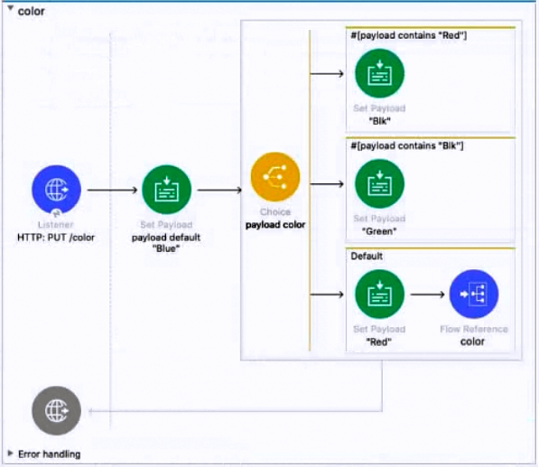


- A. “Green”
- B. A timeout error
- C. “Bik”
- D. [“Blue”, “Red”, “Bik”]
- **Correct Answer:**
    
    > C
    > 
    
    ## Answer: **C. "Bik"**
    
    ### Tracing the flow step by step:
    
    ---
    
    ### First call (payload = "Blue"):
    
    `Choice evaluates:
    ❌ "Blue" contains "Red"? NO
    ❌ "Blue" contains "Bik"? NO
    ✅ Default:
       → Set Payload = "Red"
       → Flow Reference "color" (recursive!)`
    
    ---
    
    ### Recursive call (payload = "Red"):
    
    `Choice evaluates:
    ✅ "Red" contains "Red"? YES!
       → Set Payload = "Bik"
       → Returns "Bik" back to first call`
    
    ---
    
    ### Back in first call:
    
    `Flow Reference returns with payload = "Bik"
    → Returns "Bik" to client ✅`
    
    ---
    
    ### Visual trace:
    
    `"Blue" → Default → "Red" → recursive call
                                  ↓
                             "Red" contains "Red" ✅
                                  ↓
                               "Bik" ← returned`
    
    ---
    
    ### Why not the others?
    
    | Option | Why wrong |
    | --- | --- |
    | A. "Green" | "Bik" condition never triggered on first pass |
    | B. Timeout | Recursion only happens once — no infinite loop |
    | D. Array | Flow returns single value, not array |
    
    > 💡 **Key:** The recursive call changes payload to "Red", which then matches the first condition and returns "Bik"!
    >

**Explained**

---

### Question 122

An organization is beginning to follow MuleSoft’s recommended API-led connectivity approach to use modern APIs to support the development and lifecycles of their integration solutions and to close the IT delivery gap.

What distinguishes between how modern APIs are organized in a MuleSoft-recommended API-led connectivity approach vs. other common enterprise integration solutions?

- A. The API interfaces are specified as macroservices, with one API representing all the business logic of an existing and proven end-to-end integration solution.
- B. The API implementations are monitored with common tools, centralized monitoring, and security systems.
- C. The API interfaces are specified at a granularity intended for developers to consume specific aspects of integration processes.
- D. The API implementations are built with standards using common lifecycle and centralized configuration management tools.

- **Correct Answer:**
    
    > C
    >

**Explained**

---

### Question 123

Refer to the exhibits. A Mule application polls a database table.
This error is logged when the Mule application is run.
What should be changed in the Database connector configuration to resolve this error?

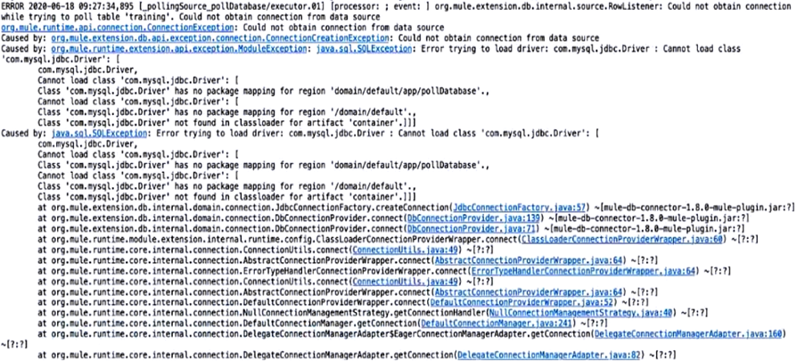


- A. Configure the correct JDBC driver
- B. Configure the correct table name
- C. Configure the correct host URL
- D. Configure the correct database name
- **Correct Answer:**
    
    > A
    >

**Explained**

---

### Question 124

Refer to the exhibit. How should the WHERE clause be changed to set the city and state values from the configured input parameters?

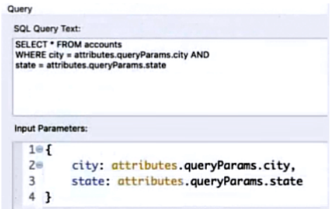

- A. WHERE city = :city AND state = :state
- B. WHERE city = [attributes.city](http://attributes.city/) AND state = attributes.state
- C. WHERE city := ${city} AND state := ${state}
- D. WHERE city = #[city] AND state = #[state]
- **Correct Answer:**
    
    > A
    >

**Explained**

---

### Question 125

Refer to the exhibits. The Set Payload transformer sets the payload to an object. The Logger component’s message attribute is configured with the string ‘Result #[INFO” ++ payload]’.
What is logged when the flow executes?

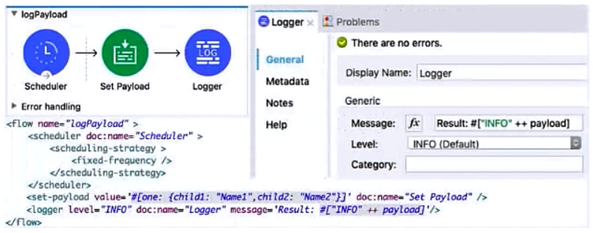

- A. ERROR … “You called the function ‘++’ with these arguments:
- 1: String (”INFO”)
- 2: Object ({one: (child1: “Name1” as String {class: “java.lang.String”},child2: “Name2” …)
- B. ERROR: You evaluated an inline expression ‘#’ without ++
- C. Result: INFO { “one”: { “child1”: “Name1”, “child2”: “Name2” } }
- D. Result: INFOpayload
- **Correct Answer:**
    
    > A
    >

**Explained**

---

### Question 126

Following MuleSoft’s recommended API-led connectivity approach, an organization has created an application network. The organization now needs to create an API to transform, orchestrate, and aggregate data proved by other APIs in the application network. This API should be flexible enough to handle data from additional APIs in the future.

According to MuleSoft’s recommended API-led connectivity approach, what is the best layer for this new API?

- A. Experience layer
- B. Security layer
- C. System layer
- D. Process layer
- **Correct Answer:**
    
    > D
    >

**Explained**

---

### Question 127

Refer to the exhibits. The main flow contains an HTTP Request operation configured to call the child flow’s HTTP Listener.

A web client sends a GET request the HTTP Listener with the qty query parameter set to 30.

After the HTTP Request operation completes, what parts of the Mule event at the main flow’s Logger component are the same as the Mule event that was input to the HTTP Request operation?

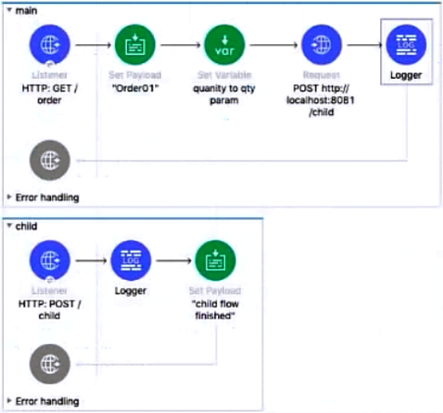

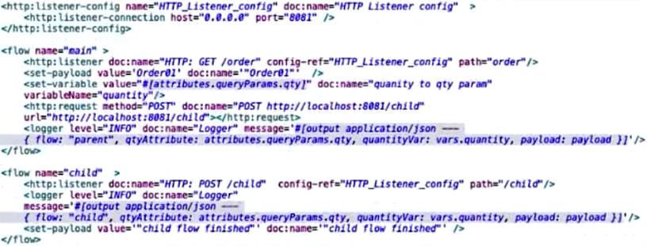


- A. The entire Mule event
- B. The payload and all variables
- C. All variables
- D. The payload and all attributes
- **Correct Answer:**
    
    > C
    >

**Explained**

---

### Question 128

A Mule application’s HTTP Listener is configured with the HTTP protocol. The HTTP Listener’s port attribute is configured with a property placeholder named http.port. The Mule application sets the http.port property placeholder’s value to 9090.

Tho Mule application’s deployed to CloudHub without setting any properties in the Runtime Manager Properties tab, and a log message reports the status of the HTTP Listener after the Mule application deployment completes.

After the Mule application is deployed, what information is reported in the worker logs related to the port on which the Mule application’s HTTP Listener listens?

- A. The HTTP Listener is listening on port 8081.
- B. The HTTP Listener is listening on port 9090.
- C. The HTTP Listener failed to bind to the port and is not listening for connections.
- D. The HTTP Listener is listening on port 80.
- **Correct Answer:**
    
    > A
    >

**Explained**

---

### Question 129

A REST Connect module is generated for a RAML specification, and then the REST Connect module is imported into a Mule application.

For each method of the RAML specification, what does the REST Connect module provide?

- A. A flow
- B. A scope
- C. An event source
- D. An operation
- **Correct Answer:**
    
    > D
    >

**Explained**

---

### Question 130

Refer to the exhibits. The Batch Job scope contains two Batch Step scopes with different accept expressions.

Input payload:
The input payload is passed to the Batch Job scope.
After the entire payload is processed by the Batch Job Scope, what messages have been logged by the Logger components?

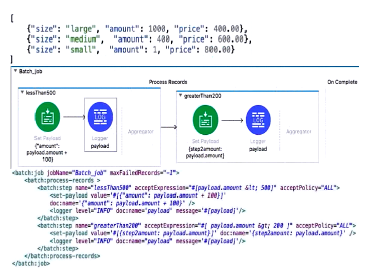

- A. { “amount”: 500 } { “amount”: 101 } { “step2amount”: 1000 } { “step2amount”: 500 }
- B. { “amount”: 500 } { “amount”: 101 } { “step2amount”: 1000 } { “step2amount”: 400 }
- C. { “amount”: 500 } { “amount”: 601 } { “step2amount”: 1000 } { “step2amount”: 500 } { “step2amount”: 601 }
- D. { “amount”: 500 } { “amount”: 101 } { “step2amount”: 1000 }
- **Correct Answer:**
    
    > A
    >

**Explained**

---

### Question 131

Refer to the exhibits. The Batch Job scope processes the array of strings.
After the Batch Job scope completes processing the input payload, what information is logged by the Logger component?

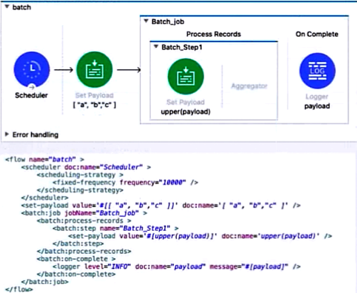

- A. [“A”, “B”, “C”]
- B. Total Records processed: 3 - Successful records: 3 - Failed Records: 0 - payload (“A”, “B”, “C”)
- C. Total Records processed: 1 - Successful records: 1 - Failed Records: 0 - payload [“A”, “B”, “C”]
- D. Total Records processed: 3 - Successful records: 3 - Failed Records: 0
- **Correct Answer:**
    
    > D
    >

**Explained**

---

### Question 132

An API instance of type API endpoint with API proxy is created in API Manager using an API specification from Anypoint Exchange. The API instance is also configured with an API proxy that is deployed and running in CloudHub.

An SLA-based policy is enabled in API Manager for this API instance.

Where can an external API consumer obtain a valid client ID and client secret to successfully send request to the API proxy?

- A. In Anypoint Studio, from components generated by APIkit for the API specification
- B. In Anypoint Studio, from components generated by REST Connect for the API specification
- C. In Runtime Manager, from the Properties tab of the deployed approved API proxy
- D. In the organization’s public API portal in Anypoint Exchange, from an approved client application for the API proxy
- **Correct Answer:**
    
    > D
    >

**Explained**

---

### Question 133

Refer to the exhibit. The Mule application’s connectors are configured with property placeholders whose values are set in the config.yaml file.
What must be added to the Mule application to link the config.yaml file’s values with the property placeholders?

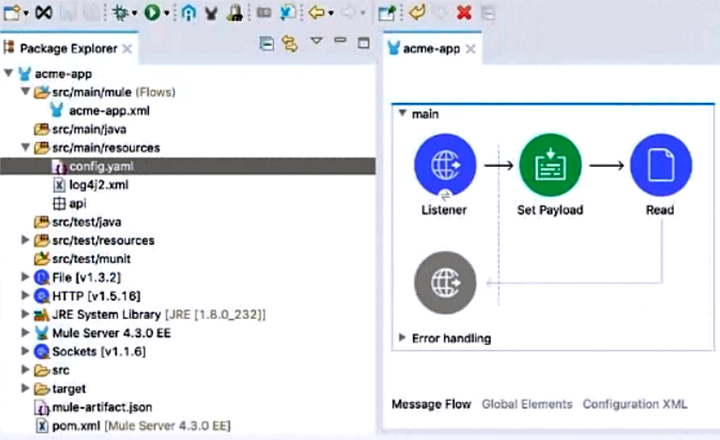

- A. A dependency element in the pom.xml file
- B. A file-config element in the acme-app.xml file
- C. A propertiesFile key/value pair in the mule.artifact.json file
- D. A configuration-properties element in the acme-app.xml file
- **Correct Answer:**
    
    > D
    >

**Explained**

---

### Question 134

A Mule project contains a DataWeave module file WebStore.dwl that defines a function named loginUser. The module file is located in the project’s src/main/resources/libs/dw folder.

What is correct DataWeave code to import all of the WebStore.dwl file’s functions and then call the loginUser function for the login “cindy.park@example.com”?

- A. import libs.dw.WebStore — loginUser( “[cindy.park@example.com](mailto:cindy.park@example.com)” )
- B. import * from libs::dw — WebStore::loginUser( “[cindy.park@example.com](mailto:cindy.park@example.com)” )
- C. import * from libs::dw::WebStore — loginUser( “[cindy.park@example.com](mailto:cindy.park@example.com)” )
- D. import libs.dw — WebStore.loginUser( “[cindy.park@example.com](mailto:cindy.park@example.com)” )
- **Correct Answer:**
    
    > C
    >

**Explained**

---

### Question 135

What is the output type of the DataWeave flatten function?

- A. Object
- B. Array
- C. Map
- D. Java
- **Correct Answer:**
    
    > B
    >

**Explained**

---

### Question 136

Refer to the exhibits. The main flow contains a Flow Reference component configured to call the child flow.

What data is passed to the child flow when the Flow Reference component is called from the main flow?

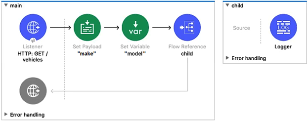


- A. The payload and all attributes
- B. The payload and all variables
- C. The entire Mule event
- D. The payload
- **Correct Answer:**
    
    > C
    >

**Explained**

---

### Question 137

A Mule application configured with autodiscovery implements an API.
Where is governance enforced for policies defined for this Mule application?

- A. In a separate API proxy application
- B. In Runtime Manager
- C. In API Manager
- D. In the Mule application
- **Correct Answer:**
    
    > C
    >

**Explained**

---

### Question 138

An organization’s Center for Enablement (CAE) has built foundational assets (API specifications and implementation template, common frameworks, and best practices guides) and published them to Anypoint Exchange.

What is a metric related to these foundational assets that helps the organization measure the success of its C4E efforts?

- A. Correlation of key performance indicators (KPIs) of production applications with foundational assets
- B. Correlation of each foundational asset with the counts of developers that downloaded each asset
- C. Utilization counts of foundational assets in production applications
- D. Counts of how many lines of businesses (LoBs) consumed each foundational asset
- **Correct Answer:**
    
    > C
    >

**Explained**

---

### Question 139

Refer to the exhibits. The Set Variable transformer is set with value #[{ first: “Max”, last “Mule” }].
What is a valid DateWeave expression to set as the message attribute of the Logger to access the value “Max” from the Mule event?

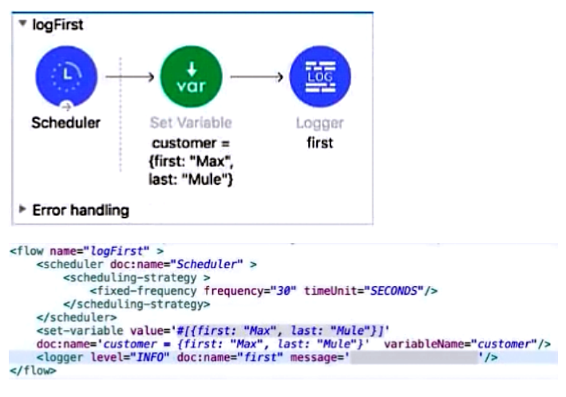

- A. vars.”customer”.”first”
- B. customer.first
- C. “customer.first”
- D. vars.”customer.first”
- **Correct Answer:**
    
    > A
    >

**Explained**

---

### Question 140

Refer to the exhibits. The Mule application configures and uses two HTTP Listener global configuration elements

The Mule application is run in Anypoint Studio.
If the Mule application starts correctly, what URI and port number(s) can receive web client requests; if the Mule application fails to start, what is the cause of the failure?

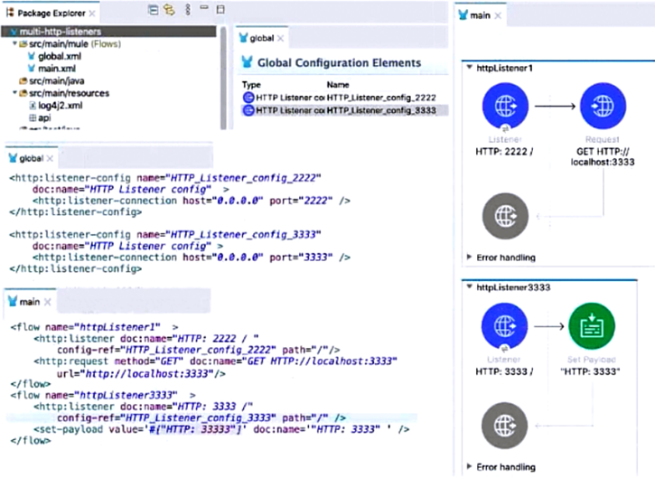

- A. The Mule application starts successfully. Web client requests can only be received at the URI on port 2222, not on port 3333.
- B. The Mule application fails to start. There is a port bind conflict because the HTTP Request also uses port 3333.
- C. The Mule application starts successfully. Web client requests can be received at the URI / on port 2222 or port 3333.
- D. The Mule application fails to start. There is a URL path conflict because both HTTP Listeners are configured with the same path /.
- **Correct Answer:**
    
    > C
    >

**Explained**

---

### Question 141


In the shipOrder flow, the payload is set to 'US'. The Choice router evaluates the When expression #[payload = 'FR'] for the domesticShipping route. What is the result when a request is made to HTTP: /ship?

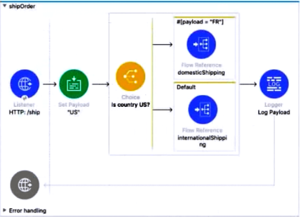
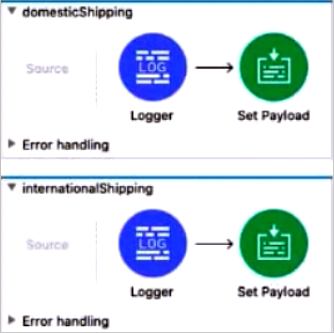


- A. The result of the domesticShipping flow
- B. A string with value “FR”
- C. A DataWeave syntax error
- D. The result of the internationalShipping flow
- **Correct Answer:**
    
    > C
    >

**Explained**

---

### Question 142

Refer to the exhibits. In the color flow, both the variable named color and the payload are set to “red”.
An HTTP POST requests then sent to the decideColor flow’s HTTP Listener.

What is the payload value at the Logger component after the HTTP Request completes?

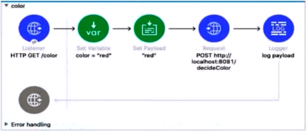

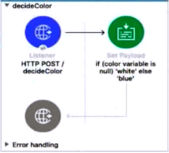

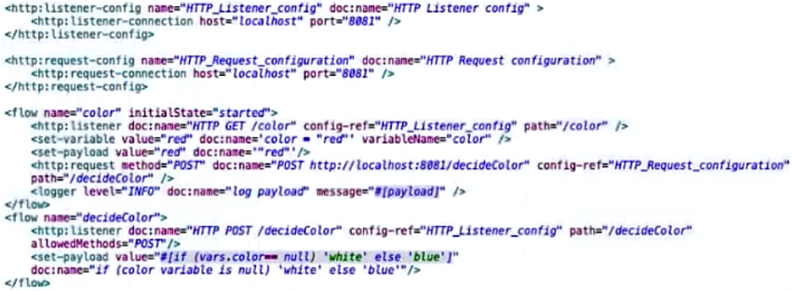


- A. “red”
- B. “blue”
- C. “white”
- D. An error message
- **Correct Answer:**
    
    > C
    >

**Explained**

---

### Question 143

Refer to the exhibits. The Mule application implements a REST API that accepts GET requests from web clients on the URLs: [http://acme](http://acme/) com/order/status and [http://acme.com/customer/status](http://acme.com/customer/status).
What path value can be set in the HTTP: GET event source to accept web client requests from both of these URLs?

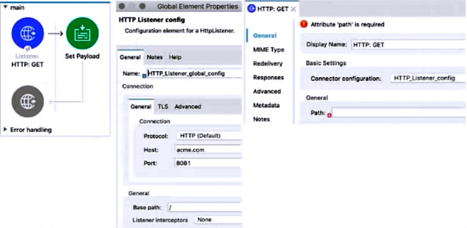


- A. ?[order,customer]/status
- B. *[order,customer]/status
- C. */status
- D. *status
- **Correct Answer:**
    
    > C
    >

**Explained**

---

### Question 144

A function named toUpper needs to be defined that accepts a string named userName and returns the string in uppercase.
What is the correct DataWeave code to define the toUpper function?

- A. fun toUpper(username) = upper(userName)
- B. var toUpper(username) = upper(userName)
- C. fun toUpper(username) -> upper(userName)
- D. var toUpper(username) -> upper(userName)
- **Correct Answer:**
    
    > A
    >

**Explained**

---

### Question 145

A shopping API contains a method to look up store details by department.
To get information for a particular store, web clients will submit requests with a query parameter named department and a URI parameter named storeId.

What is a valid RAML snippet that supports requests from web clients to get data for a specific storeId and department name?

- A. /department: get: uriParameter: storeId:
- B. get: uriParameter: {storeId}: queryParameters: department:
- C. /{storeId}: get: queryParameters: department:
- D. get: queryParameters: department: uriParameter: storeId:
- **Correct Answer:**
    
    > C
    >

**Explained**

---

### Question 146

Refer to the exhibit. A Mule application configures a property placeholder file named config.yaml to set some property placeholders for an HTTP connector.

What is a valid properties placeholder file to set these values?

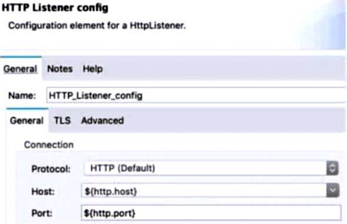

- A. { http: basePath: “api” port: “8081” host: “[localhost](http://localhost/)” }
- B. http.port = 8081 / [http.host](http://http.host/) = “[localhost](http://localhost/)”
- C. http: basePath: “api” / port: “8081” / host: “[localhost](http://localhost/)”
- D. http: port = “8081” / host = “[localhost](http://localhost/)”
- **Correct Answer:**
    
    > C
    >

**Explained**

---

### Question 147

Refer to the exhibits. The my-app.xml file contains an Error Handler scope named “global-error-handler”.

The Error Handler scope needs to be set to be the default error handler for every flow in the Mule application.
Where and how should the value “global-error-handler” be added in the Mule project so that the Error Handler scope is the default error handler of the Mule application?

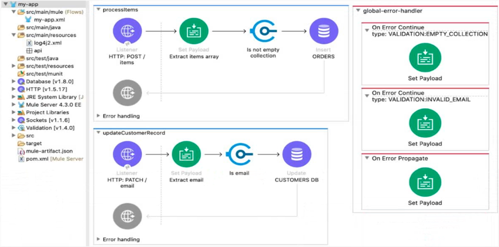


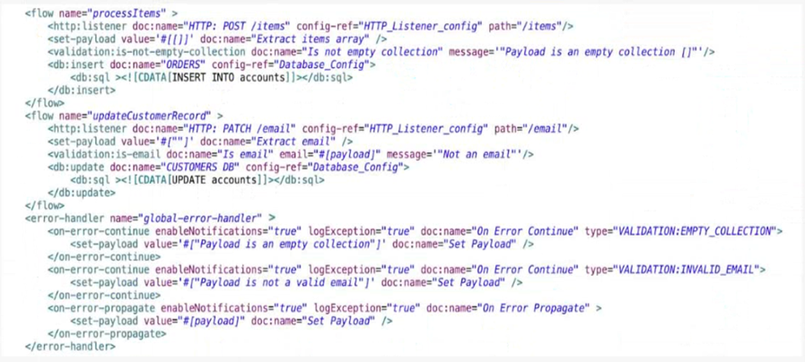


- A. In the Validation folder, as the value of a global element in the error-handling.yaml file
- B. In the my-app.xml file, as an attribute of a configuration element
- C. In the pom.xml file, as the value of a global element
- D. In the mule-artifact.json file, as the value of a key-value pair
- **Correct Answer:**
    
    > B
    >

**Explained**

---

### Question 148

An API was designed in API Designer, published to Anypoint Exchange, then imported into API Manager.
A Mule application implements this API and is deployed to CloudHub. API Manager manages this deployed API implementation.

What is the easiest and most idiomatic (used for its intended purpose) way to enforce a Client ID Enforcement policy on this Mule application?

- A. In Anypoint Studio, code a custom policy for Client ID Enforcement and then add the custom policy to Runtime Manager for the Mule application deployment
- B. In Anypoint Design Center, code a custom policy for Client ID Enforcement and then publish the custom policy to the API portal in Anypoint Exchange
- C. In API Designer, add Client ID Enforcement policy requirements to the API specification
- D. In API Manager, apply a Client ID Enforcement policy for the API instance
- **Correct Answer:**
    
    > B
    >

**Explained**

---

### Question 149

Refer to the exhibits. The updateTemp and getTemp flows share the same default object store.

A web client sends one GET request to the test flow’s HTTP Listener, which causes the test flow to call the updateTemp flow. After the test flow returns a response, the web client then sends a different GET request to the getTemp flow’s HTTP Listener. The test flow is not called a second time.

What response is returned from the request to the getTemp flow’s HTTP Listener?

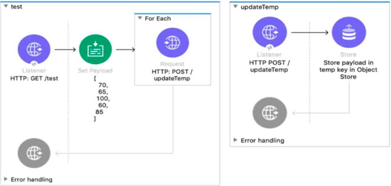

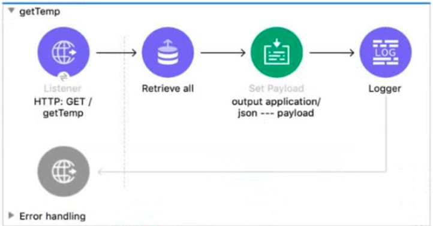

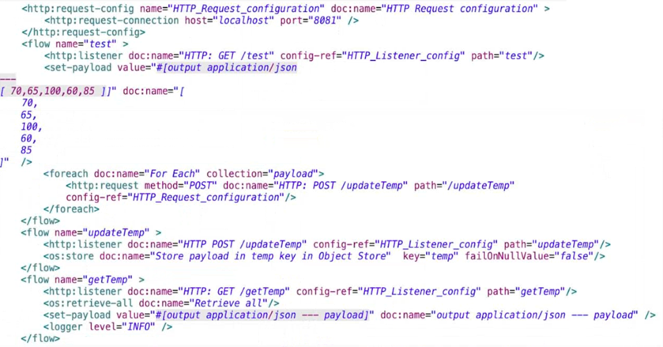

- A. { "temp": 70, "temp": 65, "temp": 100, "temp": 60, "temp": 85 }
- B. { "temp": [70, 65, 100, 60, 85] }
- C. { "temp": "100" }
- D. { "temp": "85" }
- **Correct Answer:**

    > B
    >

**Explained**

---

### Question 150

Refer to the exhibits. The Mule application does NOT define any global error handlers.

The Validation component in the private flow throws an error.
What response message is returned to a web client request to the main flow’s HTTP Listener?

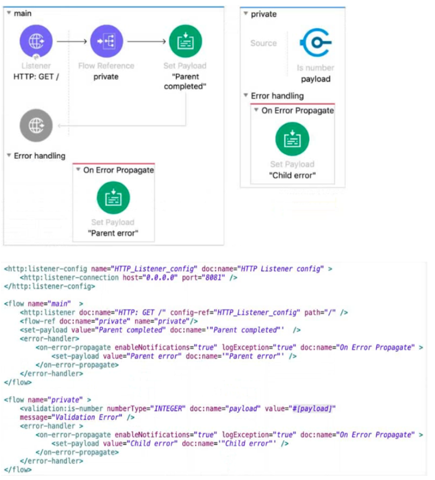


- A. “Child error”
- B. “Parent error”
- C. “Validation Error”
- D. “Parent completed”
- **Correct Answer:**
    
    > C
    >

**Explained**

---

### Question 151

Refer to the exhibits. A database Address table contains a ZIPCODE column and an increasing ID column. The Address table currently contains four (4) records. The On Table Row Database listener is configured with its watermark set to the Address table’s ZIPCODE column and then the Mule application is run in Anypoint Studio for the first time, and the On Table Row Database listener polls the Address table.

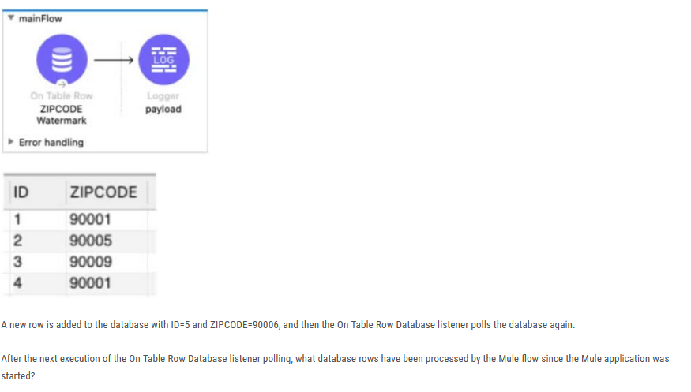

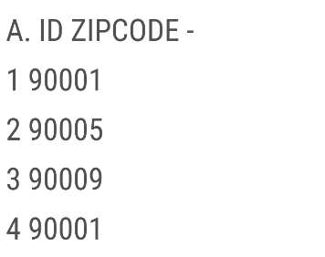
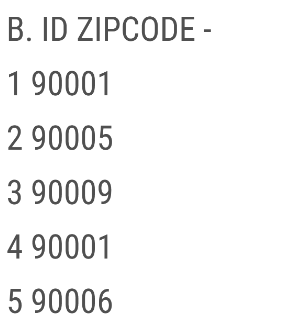
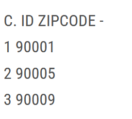
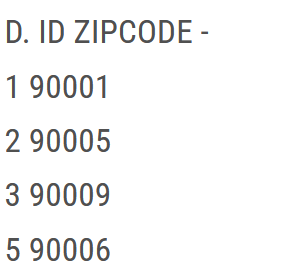

- **Correct Answer:**
    
    > A
    >

---

### Question 152

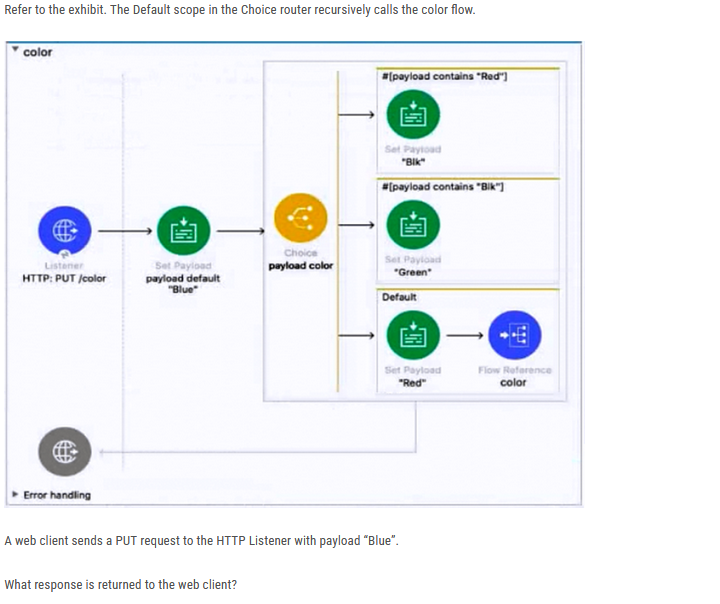


- A. “Red”
- B. “Blk”
- C. An error message
- D. “Green”
- **Correct Answer:**
    
    > C
    >

**Explained**

---

### Question 153

Refer to the exhibits. Northern Trail Outfitters is developing a Mule application to process web client POST requests with payloads containing order information, including the user name and purchased items. The Shipping connector returns a shipping address for the input payload’s user name. The Shipping connector’s Shipping Address operation is configured with a target named shippingAddress.

The Set Payload transformer needs to set an item key equal to the items value from the original received payload and a shippinglnfo key equal to the Shipping Address operation’s response.

What is a straightforward way to properly configure the Set Payload transformer with the required data?

Input payload:

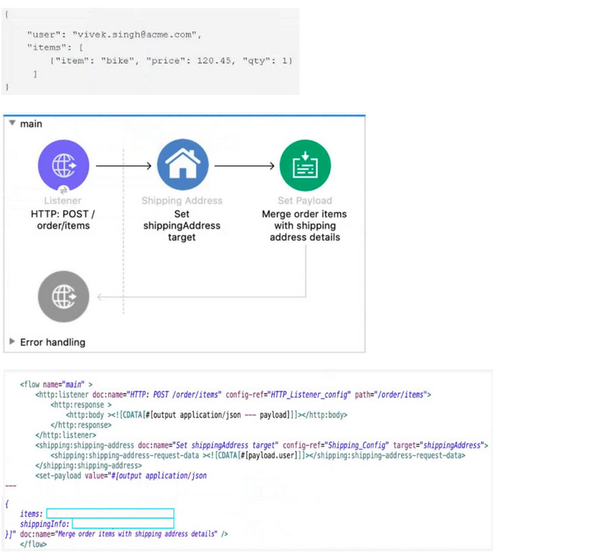
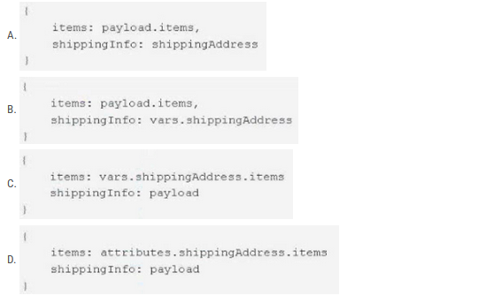

- A. Option A
- B. Option B
- C. Option C
- D. Option D
- **Correct Answer:**
    
    > B
    >

**Explained**

---

### Question 154

An HTTP:METHOD_NOT_ALLOWED error is thrown each time the webClient flow executes.
What attribute value must be changed in the webClient flow’s HTTP Request operation to prevent this error from being thrown?

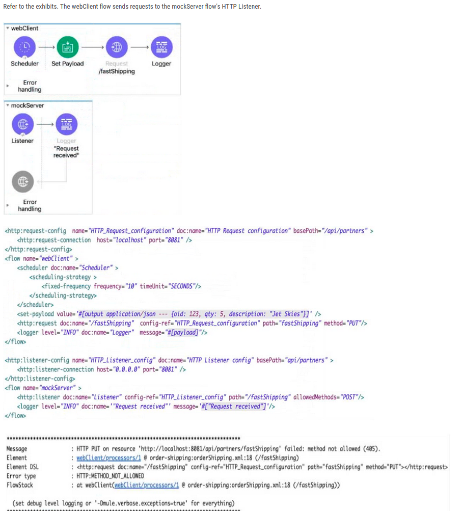

- A. Change the protocol attribute’s value to “HTTPS”
- B. Change the method attribute’s value to *(refer to exhibit)*
- C. Change the path attribute’s value to “/api/partners/fastShipping”
- D. Change the method attribute’s value to “POST”
- **Correct Answer:**
    
    > D
    >

**Explained**

---

### Question 155


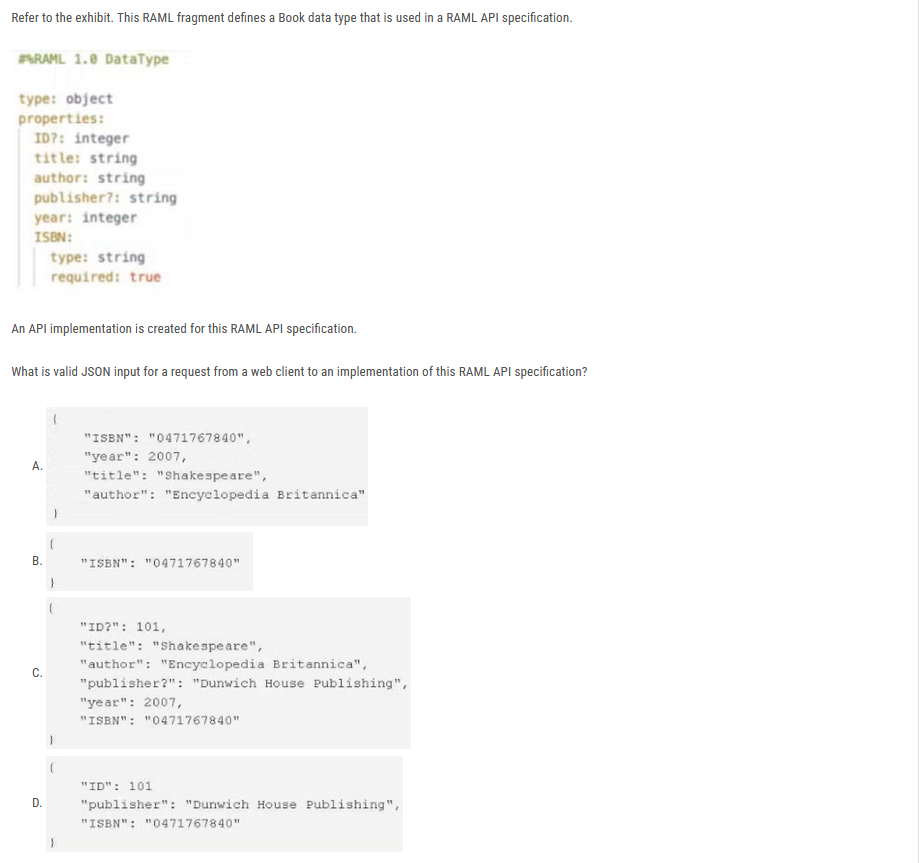


**Correct Answer:**
    
    > A
    >

**Explained**

---

### Question 156


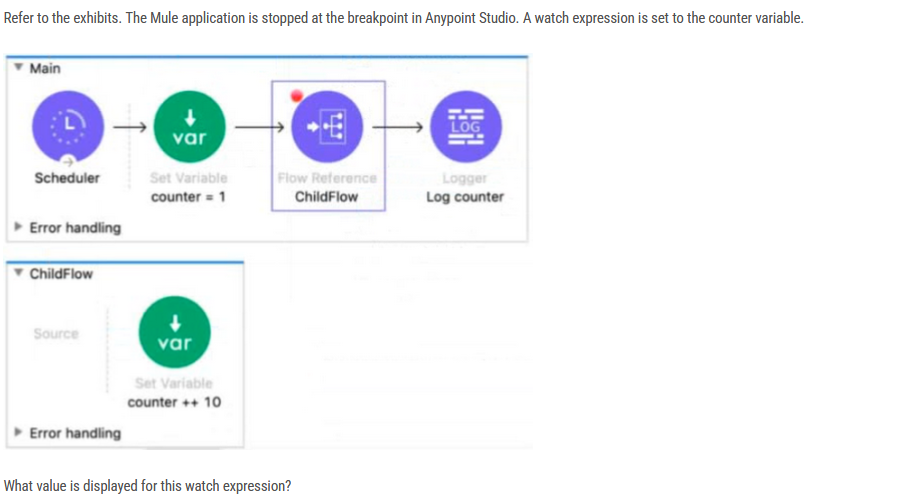


- A. 1
- B. 11
- C. 110
- D. null
- **Correct Answer:**
    
    > A
    >

**Explained**

---

### Question 157

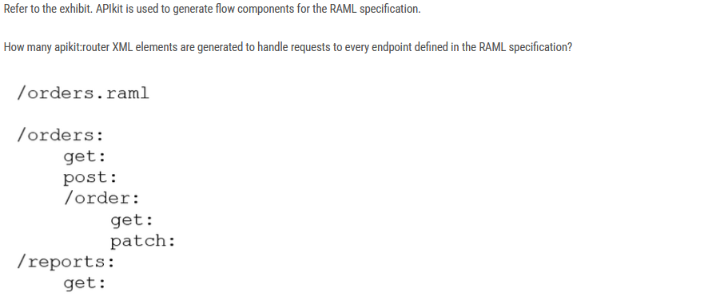

- A. 3
- B. 5
- C. 2
- D. 1
- **Correct Answer:**
    
    > B
    >

**Explained**

---

### Question 158


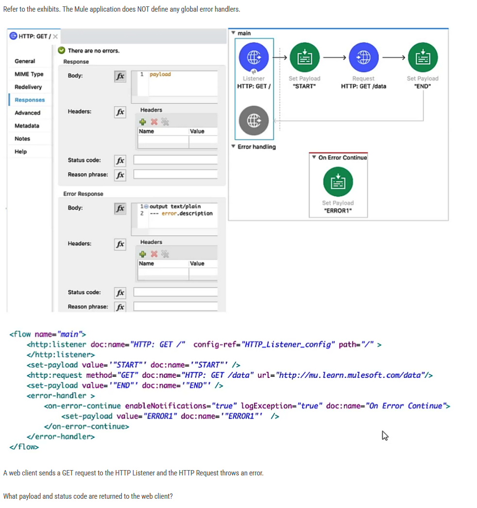


- A. Response body: “START” — Default response status code: 500
- B. Response body: “ERROR1” — Default response status code: 200
- C. Response body: “END” — Default response status code: 100
- D. Response body: “ERROR1” — Default error response status code: 400
- **Correct Answer:**
    
    > B
    >

**Explained**

---

### Question 159

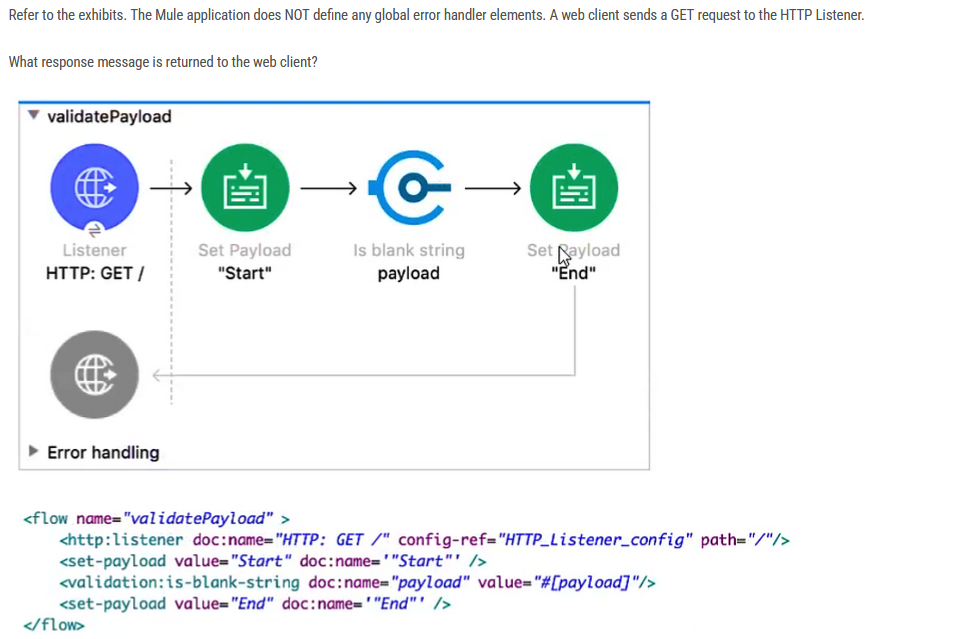

- A. “”
- B. “End”
- C. “Start”
- D. “String is not blank”
- **Correct Answer:**
    
    > D
    >

**Explained**

---

### Question 160

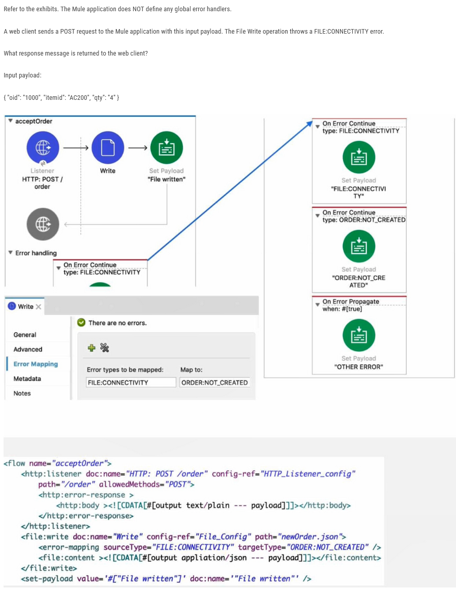

- A. “[FILE:CONNECTIVITY”](file:///CONNECTIVITY%E2%80%9D)
- B. “OTHER ERROR”
- C. “File written”
- D. “ORDER:NOT_CREATED”
- **Correct Answer:**
    
    > D
    >

**Explained**